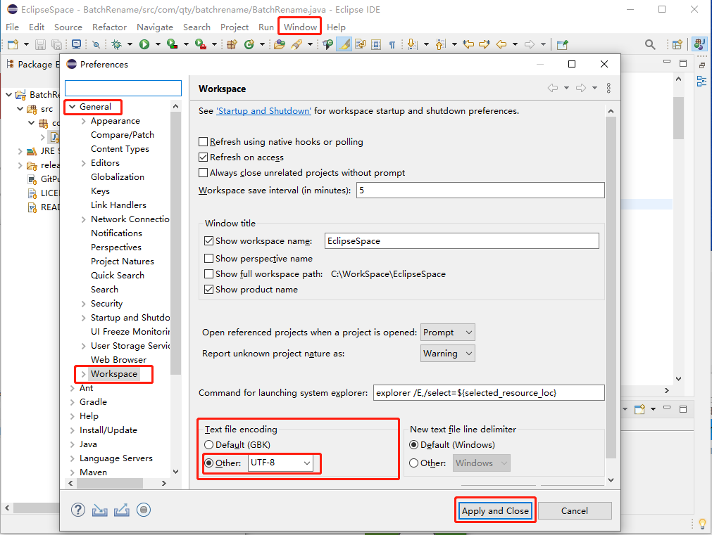
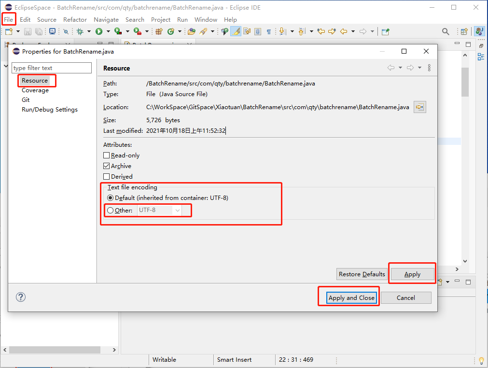

[toc]

### 1. 设置整个软件的文件编码

点击菜单 `Window` -> `Preferences` ，在打开的 `Preferences` 对话框中，在左边选择 `General` -> `Workspace`，在右边的 `Text file encoding` 框中选中 `Other`，在 `Other` 后面选择 `UTF-8`，然后点击 `Apply` 或 `Apply and Close` 按钮即可。

### 2. 设置当前工程的文件编码

点击菜单 `File` -> `Properties`， 在左边选择 `Resource`，在右边的 `Text file encoding` 框中选中 `Other`，然后在 `Other` 后面选择 `UTF-8`，最后点击 `Apply` 或者 `Apply and Close` 按钮即可。

