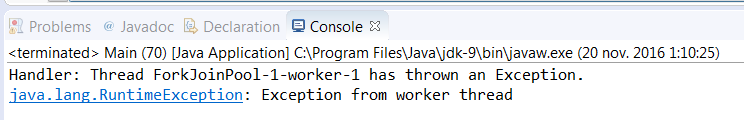

### 结果分析

本节实现了如下元素。

+ **自定义工作线程：** 通过创建继承了 `ForkJoinWorkerThread` 类的 `AlwaysThrows- ExceptionWorkerThread` 类，实现了 `fork/join` 线程池的工作线程。通过覆盖 `onStart()` 方法在工作线程启动时抛出一个 `RuntimeException` 异常。
+ **自定义线程工厂：**  `ForkJoinPool` 使用工厂来创建工作线程。因为我们希望 `ForkJoinPool` 使用 `AlwaysThrowsExceptionWorkerThread` 作为工作线程，所以必须要实现一个工厂类来创建它。要想实现工作线程的工厂，需要实现 `ForkJoinWorkerThreadFactory` 接口。该接口只有一个 `newThread()` 方法，它用于创建返回给 `ForkJoinPool` 的工作线程。
+ **任务类：** 工作线程会执行发送给 `ForkJoinPool` 的任务。要启动执行工作线程，就要把任务发送给 `ForkJoinPool` 。虽然我们实现的任务让线程休眠了1s，但是，由于 `AlwaysThrowsExceptionWorkerThread` 线程抛出了异常，因此它永远也不会执行。
+ **未捕获异常处理器：**  `ForkJoinPool` 会在工作线程抛出异常时，检查是否注册了异常处理器，我们为此开发了 `Handler` 。 `Handler` 实现了 `UncaughtException- Handler` 接口，该接口只有一个 `uncaughtException()` 方法，该方法接收一个线程和该线程抛出的异常作为参数。

我们在 `Main` 类中把这些元素放在一起，并向 `ForkJoinPool` 的构造器传递了4个构造参数。它们分别是：并行级别，也就是期望的活跃线程数；线程工厂，它为 `F``orkJoinPool` 创建线程；异常处理器，它处理工作线程抛出的未捕获异常；最后是异步模式。

本案例的执行结果如下图所示。

运行程序后能够发现工作线程抛出了一个 `RuntimeException` 异常，该异常由 `ForkJoinPool` 转交给了处理器，处理器又向控制台打印了一条消息，紧接着程序就退出了，而任务未能执行。

