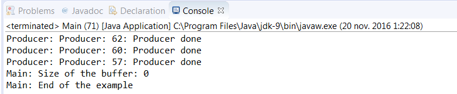

### 结果分析

本节使用以字符串作为泛型参数的 `LinkedTransferQueue` 类来实现生产者和消费者问题。 `LinkedTransferQueue` 作为缓冲区，解决了生产者和消费者之间的数据共享问题。

我们实现 `Producer` 类，用 `put()` 方法向缓冲区中添加字符串。由于一共启动了100个生产者，每个生产者向缓冲区插入10000个字符串，因此一共插入了1000000个字符串。 `put()` 方法会在缓冲区的末尾添加元素。

还实现了 `Consumer` 类，用 `take()` 方法从缓冲区获取字符串。这个方法返回并删除了缓冲区中的第一个元素。如果缓冲区是空的，则该方法会阻塞，直到缓冲区里有可消费的元素。本案例一共启动了100个消费者，每个消费者取出10000个字符串。

在本案例中，先启动消费者，后启动生产者，由于开始时缓冲区是空的，因此消费者会被阻塞，直到生产者开始向缓冲区添加字符串。

案例的部分输出如下图所示。

最后用 `size()` 方法打印缓冲区中的元素数量。这里需要注意一点，在调用该方法时，如果有线程在向缓冲区添加或删除元素，那么该方法返回的值将不准确。这是因为该方法需要遍历整个列表进行统计，而在统计时，列表还在修改。如果在调用该方法时，没有别的线程修改缓冲区，那么它就能得到一个准确的值。

