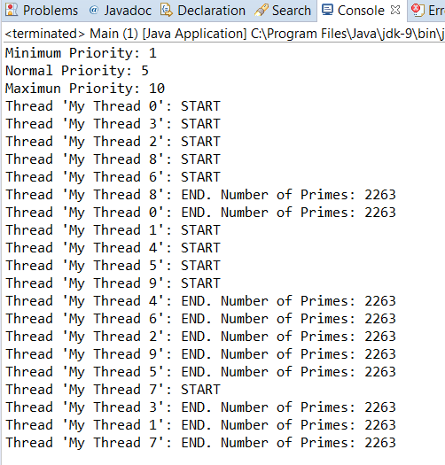
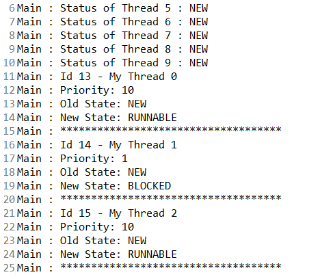

### 结果分析

下图是程序在控制台的输出，从中可以看到，线程正在并行处理各自的工作。

从下面的屏幕截图中可以看到线程是如何创建的，拥有高优先级的偶数编号线程比低优先级的奇数编号线程优先执行。该截图来自记录线程状态的 `log.txt` 文件。

每个Java应用程序都至少有一个执行线程。在程序启动时，JVM会自动创建执行线程运行程序的 `main()` 方法。

当调用 `Thread` 对象的 `start()` 方法时，JVM才会创建一个执行线程。也就是说，每个 `Thread` 对象的 `start()` 方法被调用时，才会创建开始执行的线程。

`Thread` 类的属性存储了线程所有的信息。操作系统调度执行器根据线程的优先级，在某个时刻选择一个线程使用CPU，并且根据线程的具体情况来实现线程的状态。

如果没有指定线程的名字，那么JVM会自动按照 `Thread` - `XX` 格式为线程命名，其中 `XX` 是一个数字。线程的ID和状态是不可修改的，事实上， `Thread` 类也没有实现 `setId()` 和 `setStatus()` 方法，因为它们会引入对ID和状态的修改。

一个Java程序将在所有线程完成<a class="my_markdown" href="['#anchor11']">[1]</a>后结束。初始线程（执行 `main()` 方法的线程）完成，其他线程仍会继续执行直到完成。如果一个线程调用 `System.exit()命` 令去结束程序，那么所有线程将会终止各自的运行。

创建一个 `Thread` 对象并不意味着会创建一个新的执行线程。同样，调用实现 `Runnable` 接口类的 `run()` 方法也不会创建新的执行线程。只有调用了 `start()` 方法，一个新的执行线程才会真正创建。

