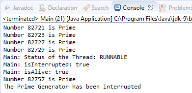

### 结果分析

下面是以上案例运行结果的截图。从图中可以看到， `PrimeGenerator` 线程在检测到自己被中断后，输出信息并结束了运行。

`Thread` 类有一个用来保存线程是否已被中断的状态属性，其属性值为 `boolean` 类型，默认值为 `false` 。当调用一个线程对象的 `interrupt()` 方法时，该状态属性将修改为 `true` 。而方法 `isInterrupted()` 仅返回该状态属性的值。

在 `main()` 方法中，输出了中断线程的一些状态信息。在本案例中，虽然在这些代码之前调用了线程的中断，但是在执行这些代码时，任务线程并未执行到中断判断和处理过程，因此，此时输出的线程状态为 `RUNNABLE` ，方法 `isInterrupted()` 的结果为 `true` ，当然方法 `isAlive()` 的结果也为 `true` 。如果这些代码执行是在 `Thread` 中断完成之后［可以制造机会，如通过在 `main` 调用 `sleep()` 使得主线程休眠1s，使得 `task` 线程完成中断，那么 `isInterrupted()` 和 `isAlive()` 的结果将为 `false` 。

