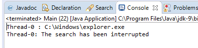

### 结果分析

案例运行结果如下图所示。可以看到， `FileSearch` 对象在检测到自己被中断时，结束了执行。

本案例使用Java异常来控制线程的中断。在执行案例时，程序通过递归检查文件夹中是否包含指定文件。例如，如果想要进入 `\b\c\d` 目录，则程序需要3次递归调用 `directoryProcess()` 方法。无论有多少次递归调用，只要它检测到中断，就会立即抛出 `InterruptedException` 异常，返回到 `run()` 方法中继续执行。

