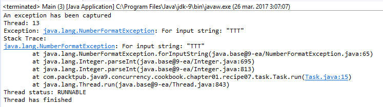

### 结果分析

案例运行结果如下图所示。异常被抛出后，异常处理器会将其捕获，然后输出该异常及抛出线程的信息。这些信息均打印到控制台：

当线程中抛出一个异常且未捕获（必须是非检查异常）时，JVM会检查是否通过相关方法为该线程配置了未捕获异常处理器（UncaughtExceptionHandler）。如果有，那么JVM将调用线程对象上相应的方法，并传递抛出的异常作为参数。

如果线程对象没有配置未捕获异常处理器，则JVM会在控制台中打印出异常信息栈，然后结束异常抛出线程的执行。

