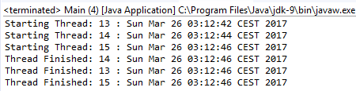

### 案例实现

根据以下步骤完成本案例。

1．首先实现一个程序来展现之前描述的问题。创建一个名为 `UnsafeTask` 的类，实现 `Runnable` 接口，并声明一个私有的 `java.util.Date` 型属性：

```css
public class UnsafeTask implements Runnable{
  private Date startDate;
```

2．实现该类的 `run()` 方法。该方法将初始化并打印 `startDate` 属性，然后随机休眠一段时间，并再次打印该属性：

```css
@Override
public void run() {
  startDate=new Date();
  System.out.printf("Starting Thread: %s : %s\n",
                    Thread.currentThread().getId(),startDate);
  try {
    TimeUnit.SECONDS.sleep( (int)Math.rint(Math.random()*10));
  } catch (InterruptedException e) {
    e.printStackTrace();
  }
  System.out.printf("Thread Finished: %s : %s\n",
                    Thread.currentThread().getId(),startDate);
}
```

3．现在来实现问题程序的主类，创建包含 `main()` 方法的 `Main` 类。在 `main()` 方法中，创建一个 `UnsafeTask` 实例，并用 `10` 个线程对象执行该任务，每隔2s启动一个执行线程：

```css
public class Main {
  public static void main(String[] args) {
    UnsafeTask task=new UnsafeTask();
    for (int i=0; i<10; i++){
      Thread thread=new Thread(task);
      thread.start();
      try {
        TimeUnit.SECONDS.sleep(2);
      } catch (InterruptedException e) {
        e.printStackTrace();
      }
    }
  }
}
```

4．程序的执行结果如下图所示。可以看出，虽然每个线程都有不同的启动时间，但在线程结束时，这些时间值又发生了变化，因为线程进行了错误的写，例如，检查ID号为13的线程<a class="my_markdown" href="['#anchor13']"><sup class="my_markdown">[3]</sup></a>：


5．正如之前所述，可以采用线程本地变量（thread-local variable）机制来解决这个问题。

6．创建一个名为 `SafeTask` 的类，并实现 `Runnable` 接口：

```css
public class SafeTask implements Runnable {
```

7．声明一个 `ThreadLocal<Date>` 类的实例，该实例的隐式实现包含返回当前时间的 `initialValue()` 方法：

```css
   private static ThreadLocal<Date> startDate=new
                                        ThreadLocal<Date>(){
  protected Date initialValue(){
    return new Date();
  }
};
```

8．实现 `run()` 方法。虽然该方法的作用与 `UnsafeTask` 的 `run()` 方法相同，但是，它们访问 `startDate` 属性的方式不同，这里使用 `startDate` 对象的 `get()` 方法：

```css
@Override
public void run() {
  System.out.printf("Starting Thread: %s : %s\n",
               Thread.currentThread().getId(),startDate.get());
  try {
    TimeUnit.SECONDS.sleep((int)Math.rint(Math.random()*10));
  } catch (InterruptedException e) {
    e.printStackTrace();
  }
  System.out.printf("Thread Finished: %s : %s\n",
               Thread.currentThread().getId(),startDate.get());
}
```

9．该案例的 `Main` 类与之前的案例基本相同，区别在于 `Runnable` 类的名字不同。

10．运行案例并查看结果。

