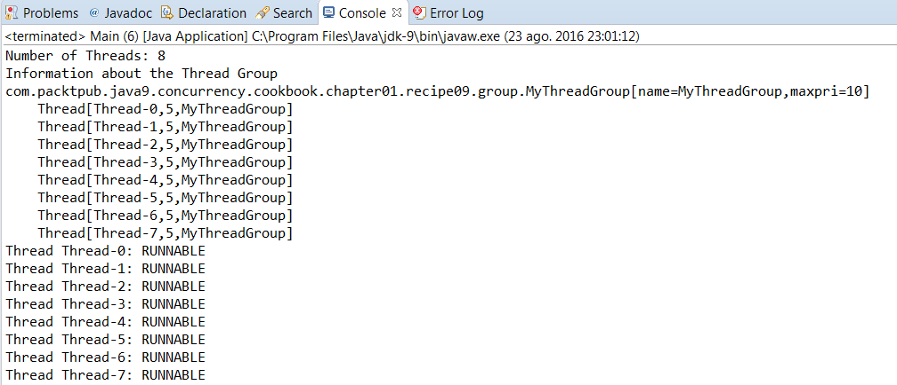
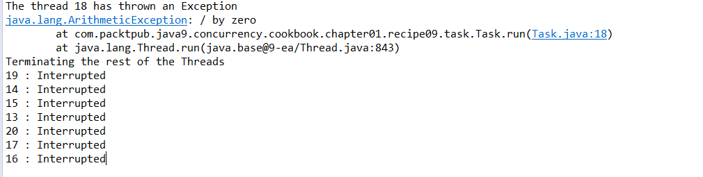

### 结果分析

从下图可以看到， `ThreadGroup` 类的 `list()` 方法的输出，以及打印的每个Thread对象的状态。

`ThreadGroup` 类存储了关联的线程对象及关联的其他线程组对象，因此它可以对其组成员进行信息访问（如状态信息）和控制（如中断控制）。

可以观察到，线程组中任意线程抛出异常后，触发了其 `uncaughtException()` 方法。该方法紧接着中断了其余线程：

当一个 `Thread` 对象中抛出未捕获异常时，JVM会为该异常依次查找3个可能的处理器。

首先，JVM会查找线程对象的未捕获异常处理器。如果该处理器不存在，则JVM将查找在1.8节中介绍的线程组的未捕获异常处理器。如果该处理器仍然不存在，则JVM将会查找默认的异常处理器。

当然，如果上述异常处理器都不存在，那么JVM会在控制台中打印异常信息栈，然后结束异常抛出线程的执行。

