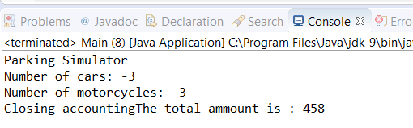

### 案例实现

根据以下步骤实现本案例。

1．创建一个不包含任何同步机制的应用。在这里，首先创建一个名为 `ParkingCash` 的类，在类中分别设置一个常量值和一个用来记录通过提供停车服务所收取金额的参数：

```css
public class ParkingCash {
private static final int cost=2;
private long cash;
public ParkingCash() {
  cash=0;
}
```

2．实现 `vehiclePay()` 方法。当一辆机动车（汽车或者摩托车）离开停车场后，调用该方法将会增加总金额的值：

```css
public void vehiclePay() {
  cash+=cost;
}
```

3．实现 `close()` 方法。该方法将向控制台中输出 `cash` 属性的值并将其重置为0：

```css
  public void close() {
    System.out.printf("Closing accounting");
    long totalAmmount;
    totalAmmount=cash;
    cash=0;
    System.out.printf("The total amount is : %d",
                      totalAmmount);
  } 
}
```

4．创建一个包含3个私有变量的 `ParkingStats` 类，并提供类初始化的方法：

```css
public class ParkingStats {
private long numberCars;
private long numberMotorcycles;
private ParkingCash cash;
public ParkingStats(ParkingCash cash) {
  numberCars = 0;
  numberMotorcycles = 0;
    this.cash = cash;
}
```

5．实现一系列机动车驶入或者离开时需要执行的方法，现金总额将在机动车驶出时增加：

```css
public void carComeIn() {
  numberCars++;
}
public void carGoOut() {
  numberCars--;
  cash.vehiclePay();
}
public void motoComeIn() {
  numberMotorcycles++;
}
public void motoGoOut() {
  numberMotorcycles--;
  cash.vehiclePay();
}
```

6．分别实现可以获得停在停车场中的汽车和摩托车数量的方法。

7．实现 `Sensor` 类。该类实现了 `Runnable` 接口，并且由该类模拟机动车在停车场中的移动情况，类中包含了 `ParkingStats` 类型的属性，它并在构造函数中完成初始化：

```css
public class Sensor implements Runnable {
  private ParkingStats stats;
  public Sensor(ParkingStats stats) {
    this.stats = stats;
  }
```

8．实现 `run()` 方法。通过该方法模拟两辆汽车和一辆摩托车驶入停车场并随后驶离停车场的情况。每个传感器将执行这个动作10次：

```css
@Override
public void run() {
  for (int i = 0; i< 10; i++) {
    stats.carComeIn();
    stats.carComeIn();
    try {
      TimeUnit.MILLISECONDS.sleep(50);
    } catch (InterruptedException e) {
      e.printStackTrace();
    }
    stats.motoComeIn();
    try {
      TimeUnit.MILLISECONDS.sleep(50);
    } catch (InterruptedException e) {
      e.printStackTrace();
    }
    stats.motoGoOut();
    stats.carGoOut();
    stats.carGoOut();
  } 
}
```

9．实现一个类名为 `Main` 的主类并添加 `main()` 方法，在 `main()` 方法中，创建 `ParkingCash` 和 `ParkingStats` 对象实例来控制系统停车情况：

```css
public class Main {
  public static void main(String[] args) {
    ParkingCash cash = new ParkingCash();
    ParkingStats stats = new ParkingStats(cash);
    System.out.printf("Parking Simulator\n"
```

10．创建名为 `Sensor` 的任务，并使用 `availableProcessors()` 方法（该方法用于返回当前JVM中可用的处理器数量，通常这个值和处理器的内核数一致）来计算当前停车场中拥有的检测器数量。创建对应个数的 `Thread` 对象并且把它们存储到数组当中：

```css
intnumberSensors=2 * Runtime.getRuntime()
                                    .availableProcessors();
Thread threads[]=new Thread[numberSensors];
for (int i = 0; i<numberSensors; i++) {
  Sensor sensor=new Sensor(stats);
  Thread thread=new Thread(sensor);
  thread.start();
  threads[i]=thread;
}
```

11．用 `join()` 方法等待线程执行结果：

```css
for (int i=0; i<numberSensors; i++) {
  try {
    threads[i].join();
  } catch (InterruptedException e) {
    e.printStackTrace();
  }
}
```

12．在控制台中输出统计的结果：

```css
    System.out.printf("Number of cars: %d\n",
                      stats.getNumberCars());
    System.out.printf("Number of motorcycles: %d\n",
                      stats.getNumberMotorcycles());
    cash.close();
  }
}
```

该案例运行在一台四核计算机上，因此该停车场将拥有8个 `Sensor` 任务。每个任务都会执行10次，在每一次中，都将有3辆机动车驶入并且随后驶离停车场。因此，每一个 `Sensor` 任务都会模拟30辆车的移动情况。

如果一切执行顺利，则最终结果将如下所示：

+ 没有车驻留在停车场中，这意味着所有车驶入并且完全驶出停车场。
+ 8个 `Sensor` 任务都成功执行，每个任务模拟完成30辆车的运行情况并且每辆车的移动将会给停车场带来3美元的收入，因此停车场的最终收入是480美元。

每次执行上面的示例代码时，你都可能得到不同的执行结果，并且大部分都是错误执行结果，下图所示的是某次的运行结果：


由于程序中存在竞态条件，并且不同的共享变量被所有线程访问，最终导致了错误的执行结果，因此接下来将通过 `synchronized` 关键字来修改上述代码以解决相关问题。

1．在 `ParkingCash` 类中的 `vehiclePay()` 方法前添加 `synchronized` 关键词：

```css
public synchronized void vehiclePay() {
  cash+=cost;
}
```

2．对 `close()` 方法内的代码块增加 `synchronized` 关键词保护：

```css
public void close() {
  System.out.printf("Closing accounting");
  long totalAmmount;
  synchronized (this) {
    totalAmmount=cash;
    cash=0; 
  }
  System.out.printf("The total amount is : %d",totalAmmount);
}
```

3．在 `ParkingStats` 类上增加两个新的属性，并在构造函数中完成构建：

```css
private final Object controlCars, controlMotorcycles;
public ParkingStats (ParkingCash cash) {
  numberCars=0;
  numberMotorcycles=0;
  controlCars=new Object();
  controlMotorcycles=new Object();
  this.cash=cash;
}
```

4．最后修改增减机动车数量的方法实现，它包括使用 `synchronized` 关键词。由 `controlCars` 对象保护 `numberCars` 变量，并由 `controlMotorcycles` 对象保护 `numberMotorcycles` 属性。在 `getNumberCars()` 方法和 `getNumberMotorcycles()` 方法中必须使用相应的引用对象：

```css
public void carComeIn() {
  synchronized (controlCars) {
    numberCars++;
  }
}
public void carGoOut() {
  synchronized (controlCars) {
    numberCars--;
  }
  cash.vehiclePay();
}
public void motoComeIn() {
  synchronized (controlMotorcycles) {
    numberMotorcycles++;
  }
}
public void motoGoOut() {
  synchronized (controlMotorcycles) {
    numberMotorcycles--;
  }
  cash.vehiclePay();
}
```

5．执行上述代码，比较当前程序代码和之前的运行结果。

