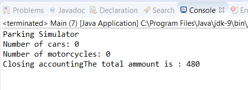

### 结果分析

程序的执行结果如下图所示，而且无论什么时候执行，都能得到相同的执行结果。

让我们来比较一下 `synchronized` 关键词在不同案例上的差别：

+ 如果同时有两个以上的 `Sensor` 任务线程使用了受保护的 `vehiclePay()` 方法，则只有一个线程能够获得该方法的执行权限，而其余线程只能暂停等待，因此可以保证最终的总金额是正确的。
+ 使用不同的对象来控制汽车和摩托车的计数值。在这里，一个 `Sensor` 任务线程可以修改 `numberCars` 的值，而同时另一个 `Sensor` 任务可以修改 `numberMotorcycles` 的值。然而，两个 `Sensor` 任务线程不能同时修改同一个属性，因此可以保证两类机动车计数值的最终结果是正确的。

最后，同步访问 `getNumberCars()` 和 `getNumberMotorcycles()` 两个方法。通过使用 `synchronized` 关键词可以保障在并发程序中共享数据的正确访问。

本节仅有一个线程可以访问由关键词 `synchronized` 修饰的方法。如果线程A正在执行 `synchronized` 方法，而线程B试图执行同一个对象中的另一个同步方法，则此时线程B将会阻塞直到线程A执行完毕。但是如果线程B执行在不同对象实例上的同一个方法，则不会被线程A的执行阻塞。

当用 `synchronized` 关键词来保护一段代码块时，需要在参数中传入一个对象，JVM将只允许一个线程可以访问所有由该对象保护的代码块（注意，当前讨论的是对象实例，而非类对象）。

我们也用到了 `TimeUnit` 类。 `TimeUnit` 类是具有以下常量的枚举： `DAYS` 、 `HOURS` 、 `MICROSECONDS` 、 `MILLISECONDS` 、 `MINUTES` 、 `NANOSECONDS` 以及 `SECONDS` 。这些都代表了期望线程休眠的时间单位，在本例中，线程将休眠50ms。

