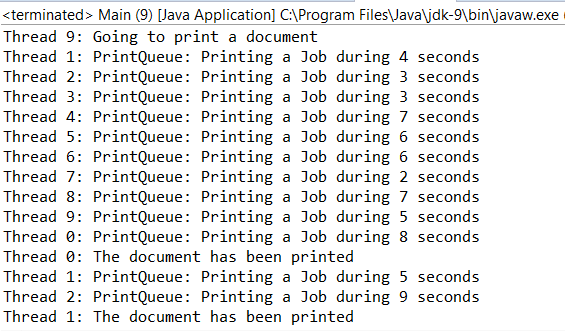

### 结果分析

程序执行的部分输出结果如下图所示：

本案例的关键在于 `PrintQueue` 类中的 `printJob()` 方法。如果需要保证当前只有一个线程可以访问临界区代码，则可能需要创建一个 `ReentrantLock` 类型的对象，并且把对象的 `lock()` 方法应用到临界区代码的开始位置。当线程A调用该方法的时候，若它发现当前没有其他线程取得该线程的锁，则该锁的使用权将立即交给线程A并且在该临界区中执行线程A的。如果此时有另外一个线程（不妨称为线程B），已经在执行该临界区代码，那么此时线程A将会调用 `lock()` 方法进入休眠直到线程B执行完毕。

在临界区代码结尾，需要通过 `unlock()` 方法释放锁以保证其他线程能够顺利进入临界区。如果开发者忘记在临界区代码结束时使用 `unlock()` 方法，那么其他线程将永远等待未释放的锁，这也就是我们常说的死锁。因此，如果你在临界区代码中使用了 `try-catch` 代码结构，那么千万不要忘记在 `finally` 代码块中增加一个 `unlock()` 方法。

本案例同样测试了公平锁的策略。每个任务都需要执行两段临界区的代码。通过之前的截图，你可以看到每个任务是如何从第一个临界区过渡到第二个临界区的。截图展示的是通常情况下的运行状态，不过如果当前任务运行在非公平策略中，也就是说，传入 `false` 到 `ReentrantLock` 类参数中，那么会有例外情况出现。

相反，如果传入 `true` 到 `Lock` 类的构造函数中，那么应用会有不同的运行结果。第一个请求锁的线程是 `Thread 0` ，第二个为 `Thread 1` ，以此类推。当 `Thread 0` 运行在第一段临界区代码时，有其他9个线程等待在同一个临界区外。 `Thread 0` 释放了锁的同时，又再次发起对同一个锁的请求，此时会同时有10个线程在请求同一把锁。基于公平锁策略，锁的使用权将会交给等待时间最长的线程也就是 `Thread 1` ，紧接着是 `Thread 2` ，然后是 `Thread 3` ，以此类推。当所有线程都顺利通过第一个临界区却尚未进入第二个临界区时，所有的线程都将在第二个临界区外部等待分配锁的使用权，因此锁的使用权又重新交给了 `Thread 0` 线程，待 `Thread 0` 执行完毕后交给 `Thread 1` ，以此类推。下图中展示了和之前不一样的运行结果：

