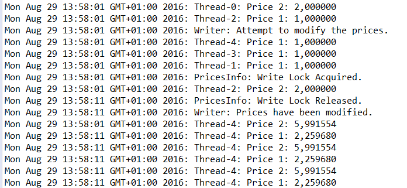

### 结果分析

某次执行后控制台的输出结果如下图所示。

可以看到在获得了写锁以后，所有的读线程都无法顺利读取到数据。在控制台的输出中可能会看到在 `Write Lock Acquired` 之后还有读线程读取到的数据，不过这行输出只是之前已经执行完却还没来得及输出到控制台中的信息。可以看到，当写锁释放后，大量商品价格信息输出在控制台上。

前面已经提到， `ReentrantReadWriteLock` 分别有读锁和写锁两种锁。在 `ReadWriteLock` 接口上定义的 `readLock()` 方法上可以成功地使用读锁。另外，读锁是一类实现 `Lock` 接口的对象，因此，我们也可以在读锁对象上使用 `lock()` 、 `unlock()` 和 `tryLock()` 3种方法。类似地，我们可以在通过 `ReadWriteLock` 的 `writeLock()` 来调用对象的写锁。由于写锁对象的本身也实现了 `Lock` 接口的方法，因此我们可以在写锁对象上使用 `lock()` 、 `unlock()` 和 `tryLock()` 3种方法。开发者要确保在正确的场合下使用正确的锁，使用场景需要和最初设计的目的一致。当使用一个实现在 `Lock` 接口上的读锁时，不能同时有另外一个线程在修改同一个对象上的数据，否则，可能会产生不一致的错误结果。

