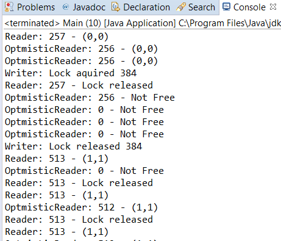

### 结果分析

本案例分别测试了3种不同锁模式的执行情况。在程序中， `Writer` 任务通过 `writeLock()` 方法获得锁（以写模式获得锁）， `Reader` 任务通过 `readLock()` 方法获得锁（以读模式获得锁）， `OptimisticRead` 任务用 `tryOptimisticRead()` 和 `validate()` 方法分别尝试获得锁并且检查是否可以访问临界变量。

如果前两种方法可以获得锁，那么它们将会一直等待，直到获得了锁。调用 `tryOptimisticRead()` 方法总能获得一个返回值，如果线程无法获得锁，那么返回值为0；如果线程可以获得锁，那么返回值会是一个非零值。记住，在这种情况下，我们需要用 `validate()` 方法来判断是否可以真正地访问数据。

某次程序执行的一部分结果如下图所示：

在 `Writer` 任务获得了锁的控制权后，其他两个任务（也就是 `OptimisticReader` 和 `Reader` ）就不能顺利地访问受保护的数据了。 `Reader` 任务将因为 `readLock()` 方法而暂停执行，而 `OptimisticReader` 任务在调用 `validate()` 方法后会得到返回值 `false` ，在调用 `tryOptimisticRead()` 方法后得到返回值0，这表示当前锁由另一个线程在写模式下控制。在 `Writertask` 任务释放锁后， `Reader` 和 `OptimisticReader` 都将能够访问共享对象的值。

