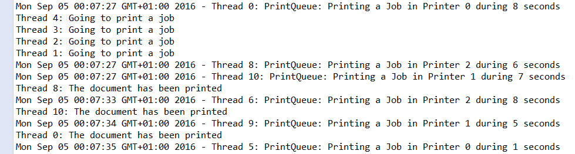

### 结果分析

`PrintQueue` 类的 `printJob()` 方法是本案例的关键所在。该方法展示了使用信号量实现临界区来保护共享资源所要遵循的3个步骤。

+ 调用 `acquire()` 方法获得信号量。
+ 操作共享资源。
+ 调用 `release()` 方法来释放信号量。

案例中的另一个重点是在 `PrintQueue` 构造器中对 `Semaphore` 对象的初始化。这里为 `Semaphore` 构造器传入了参数3，表示要创建保护3个资源的信号量。前3个调用 `acquire()` 方法的线程能立即访问临界区，而其他线程将被阻塞。直到某个线程执行完毕临界区代码，并调用 `release()` 方法释放信号量之后，被阻塞的一个线程才能够获得信号量。

案例程序执行的输出结果如下图所示：

可以看到，在同时启动的线程中，起初只有3个线程执行了打印任务。而后每当一个打印机完成打印任务后，另一个线程才开始执行打印任务。

