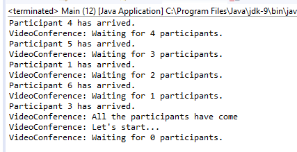

### 结果分析

`CountDownLatch` 类有3个基本元素。

+ 构造器中的初始化参数，它决定 `CountDownLatch` 对象需要等待的事件数量。
+ `await()`  方法，希望等待所有事件结束的线程需要调用该方法。
+ `countDown()` 方法，事件在结束执行后调用。

在创建 `CountDownLatch` 对象时，构造器的参数将用来初始化对象内部的计数器。每次调用 `countDown()` 方法时， `CountDownLatch` 对象的计数器的值都减1。当计数器的值为0时， `CountDownLatch` 对象唤醒全部因调用 `await()` 方法而休眠等待的线程。

`CountDownLatch` 对象的计数器不能重新初始化，也不能直接修改。这意味着，一旦在构造方法中对 `CountDownLatch` 对象内部的计数器完成初始化后，只能通过之前介绍的 `countDown()` 方法来修改。当计数器的值为0时，所有因调用 `await()` 方法而休眠的线程都将立即停止阻塞而返回。接下来所有对该对象的 `countDown()` 方法的调用将不会产生任何作用。

和其他同步机制相比，该方法有如下不同点。

+ `CountDownLatch` 提供的机制并不是用来保护共享资源或者临界区的，而是用来同步一个或者多个任务的线程的。
+ 其实例对象的同步作用是一次性的。正如之前所示，当 `CountDownLatch` 对象内部的计数器的值为0时，后续对其的调用将不会产生任何作用。这意味着，如果还想进行同样的同步，则需要创建新的 `CountDownLatch` 对象。

案例执行的输出结果如下图所示：

可以看到，随着与会者的抵达，一旦 `CountDownLatch` 对象的计数器的值变为0，该对象将唤醒 `Videoconference` 对象，接着 `Videoconference` 对象输出一条信息，表明所有与会者均已到达，视频会议可以开始了。

