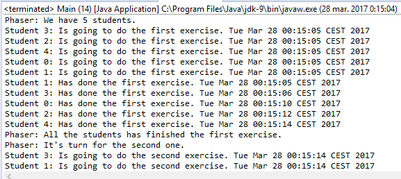

### 结果分析

本案例模拟了一场有3道考题的考试。只有所有学生完成当前考题，才可以进入下一答题环节。可以使用 `Phaser` 类来满足该需求。然而，该案例需要继承原生的 `Phaser` 类并重写 `onAdvance()` 方法来实现自定义的 `Phaser` 类。

`Phaser` 阶段转变和唤醒被 `arriveAndAwaitAdvance()` 方法休眠的线程前，会调用 `onAdvance()` 方法。该方法可以被视为一个阶段最后一个线程所执行 `arriveAndAwait- Advance()` 方法的一部分。该方法接收代表当前阶段的数字作为参数（其中0表示第一个阶段），它还接收一个代表参与者数量的参数。其中最重要的参数是阶段数，如果需要根据不同的阶段数来执行不同的操作，就需要使用选择结构来执行正确的操作。在本案例中，我们使用多分支选择结构 `switch` 来根据不同的阶段选择不同的操作。

`onAdvance()` 方法返回一个布尔值来表明 `Phaser` 对象是否处于终止状态。如果返回值为 `false` ，则表明 `Phaser` 对象还没终止，此时，线程将会继续执行后续阶段；如果返回值为 `true` ，则 `Phaser` 对象会唤醒其他待定线程，但是它会进入终止状态。此时，调用该 `Phaser` 对象的所有方法将立即返回， `isTerminated()` 方法将返回 `true` 。

在 `Main` 类中，创建 `MyPhaser` 对象时并未指明参与者的数量。但是为每个创建的 `Student` 对象调用 `register()` 方法可实现向 `Phaser` 对象注册参与者。这种方式不会为 `Student` 对象（或者其执行线程）与 `Phaser` 对象建立关联。事实上，在 `Phaser` 对象中参与者数量只是一个数字，并没有其他关系。

案例运行结果如下图所示。

可以看出，不同的学生在不同时刻完成了第一道题，当所有学生都完成第一道题时，控制台日志表明 `Phaser` 对象调用了 `onAdvance()` 方法。与此同时，所有学生开始回答第二道题。

