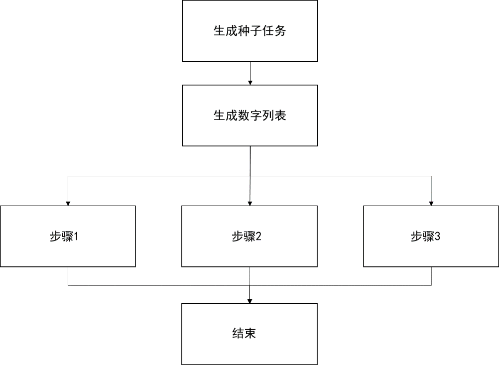

### 3.8　异步地完成和关联任务

Java 8 并发API中包含的 `CompletableFuture` 类提供了一种新的同步机制。该类实现了 `Future` 对象和 `CompletionStage` 接口，它们具有如下两个特征。

+ 作为 `Future` 对象， `CompletableFuture` 会在将来返回一个结果。
+ 作为 `CompletionStage` 对象，可以在一个或多个 `CompletableFuture` 对象完成任务以后，执行额外的异步任务。

有如下3种使用 `CompletableFuture` 类的方法。

+ 主动创建一个 `CompletableFuture` 对象，使其作为两个任务之间的同步点。一个任务创建一个值，并作为 `Completable` 对象的 `complete()` 方法的参数，该值将由 `CompletableFuture` 返回，另一个任务可以调用 `get()` 或 `join()` 方法等待该值。
+ 通过 `CompletableFuture` 类的静态方法 `runAsync()` 和 `supplyAsync()` 来执行 `Runnable` 或 `Supplier` 。这些方法将会返回一个 `CompletableFuture` 对象，并且在这些任务结束运行以后，该对象将进入完备态。在第二种情况下， `Supplier` 的返回值即为 `CompletableFuture` 对象完备态的值。
+ 附加声明的任务将会在一个或多个 `CompletableFuture` 对象执行完毕后异步执行。该任务可以实现 `Runnable` 、 `Function` 、 `Consumer` 或 `BiConsumer` 接口。

这些特性使得 `CompletableFuture` 类非常灵活和强大。本节将介绍使用该类组织不同任务的方法。下图所示为案例中任务的主要执行方式：

首先，创建一个用来生成种子任务，下一个任务用该种子来生成随机数字列表。然后，执行3个并行任务。

步骤1：将计算随机数字列表中最接近1000的数字。

步骤2：将计算随机数字列表中的最大数。

步骤3：将计算随机数字列表中，最大数与最小数的平均值。

