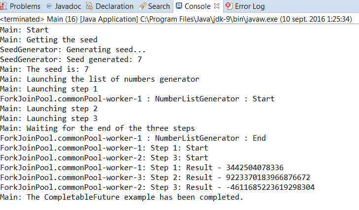

### 结果分析

使用 `CompletableFuture` 对象可以实现如下两个主要目的。

+ 等待一个会在将来生成的值或事件（创建一个对象使用其 `complete()` 和 `get()` 或者 `join()` 方法）。
+ 组织执行指定顺序的任务，这样一个或多个任务在其他任务还未结束时就不会开始执行。

在本案例中，这两个功能都得到了应用。首先，创建了一个该类的实例，并将其作为参数传递给 `SeedGenerator` 任务。该任务通过 `complete()` 方法传递计算值，并且 `main()` 方法通过 `get()` 方法得到该计算值。 `get()` 方法会阻塞调用线程，直到 `CompletableFuture` 进入完备态<a class="my_markdown" href="['#anchor36']">[6]</a>。

接着，用 `supplyAsync()` 方法生成一个 `CompletableFuture` 对象。该方法接收一个 `Supplier` 接口的实现作为参数，该接口定义的 `get()` 方法必须有返回值。 `supplyAsync()` 方法返回的 `CompletableFuture` 对象，在 `get()` 方法结束执行后，进入完备态。而完备态的值就是 `get()` 方法的返回值。而返回的 `CompletableFuture` 对象将会由 `ForkJoinPool` 的静态方法 `commonPool()` 中的任务来执行。

然后，用 `thenApplyAsync()` 方法来关联一些任务。可以通过 `CompletableFuture` 对象来调用该方法，该方法接收一个 `Function` 接口的实现作为参数，这个参数可以使用函数式编程代码或者独立的对象来表示。 `CompletableFuture` 对象生成的值会直接作为参数传递给 `Function` 的实现，这点非常有用。在本例中，这意味着，接下来的3步都会以参数方式接收到随机的数字列表。而返回的 `CompletableFuture` 对象将会由 `ForkJoinPool` 的静态方法 `commonPool()` 中的任务来执行。

最后，用 `CompletableFuture` 类的静态方法 `allOf()` 来等待所有任务执行结束。该方法接收变长的 `CompletableFuture` 对象作为参数，并且在所有传入的 `Completable- Future` 参数进入完备态后，返回一个 `CompletableFuture` 。 `thenAcceptAsync()` 是另外一个同步任务的方法，该方法接收 `Consumer` 作为参数，在调用该方法的 `CompletableFuture` 对象进入完备态后，会有默认的执行器来执行 `Consumer` 。在程序的最后，使用 `join()` 方法来等待最后一个 `CompletableFuture` 对象结束。

本案例的运行过程如下图所示。可以看到任务是如何按照指定顺序执行的：

