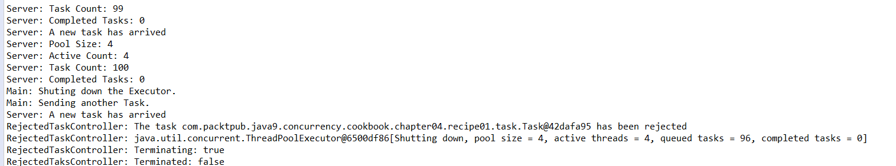

### 结果分析

本案例的核心在于 `Server` 类，这个类创建并使用 `ThreadPoolExecutor` 来执行任务。

其中最重要的一点是在 `Server` 类的构造方法内创建 `ThreadPoolExecutor` 实例对象。虽然 `ThreadPoolExecutor` 类提供了4种不同的构造方法，但是为了简化开发，Java并发API提供了 `Executors` 类来创建执行器和其他并发的相关对象。尽管你可以直接使用 `ThreadPoolExecutor` 中的任意一个构造方法来创建对象，但是本书仍然推荐使用 `Executors` 类。

本案例用 `Executors` 类的 `newFixedThreadPool()` 方法创建了一个可缓存的线程池，并使用它来创建执行器。该方法创建了一个线程数有上限的执行器。如果提交的任务数量超过设置的线程数，则超出部分的任务将会阻塞，直到有空闲线程可以执行它们。可以通过传递参数的方式来设置执行器的最大线程数，在本案例中，我们使用 `Runtime` 类的 `availableProcessors()` 方法来返回当前JVM可用的处理器数量。一般来说，这个数字会和计算机的内核数相同。

重用线程可以有效地降低创建线程的代价。然而，这个可缓存的线程池有一个缺陷：即便有新的任务提交，它缓存的线程数量仍然不变。因此，如果提交了过多的任务给执行器，则可能会导致系统过载。

一旦创建了执行器，就可以提交 `Runnable` 或者 `Callable` 类型的任务，并调用 `execute()` 方法来执行它们。本案例提交的是实现 `Runnable` 接口的 `Task` 类型的对象。

也可以打印一些包含执行器信息的详细日志。一般来说，可以使用下面的方法。

+ `getPoolSize()` ：该方法返回执行器线程池中当前的线程数。
+ `getActiveCount()` ：该方法返回执行器中正在执行任务的线程数。
+ `getTaskCount()` ：该方法返回等待执行的任务数。由于等待执行的任务数是动态变化的，因此该方法返回的只是一个近似值。
+ `getCompletedTaskCount()` ：该方法返回执行器已经完成的任务数。

以 `ThreadPoolExecutor` 类为代表的执行器的一个重要特点，就是必须显式地终止它。如果不这么做，则执行器会一直运行下去，不会主动停止。当执行器没有任务可以执行时，它也会继续等待新任务的提交而非终止运行。因为一个Java应用在所有非守护线程终止之前是不会停止运行的，所以如果不终止执行器，则Java应用也不会结束。

可以使用 `shutdown()` 方法告知执行器来终止自身。当执行器运行完成所有已提交的任务后，它会停止运行。在本案例中，当调用 `shutdown()方` 法后，如果试着提交一个任务给执行器，且没有重写拒绝策略的相关方法，则执行器会拒绝任务并抛出一个 `Reject- ExecutionException` 异常。如果想要管理执行器的拒绝策略，则需要创建一个实现 `RejectExecutionHandler` 接口的类。 `RejectExecutionHandler` 接口提供了一个名为 `rejectedExecution()` 的方法，它包含如下两个参数。

+ 存储被拒绝任务的 `Runnable` 对象。
+ 存储拒绝任务执行器的 `Executor` 对象。

执行器拒绝任务时，要想调用这个方法，需要用 `ThreadPoolExecutor` 类中的 `setRejectedExecutionHandler()` 方法来设置拒绝策略。

本案例的部分运行结果如下图所示：

如图所示，当最后一个任务提交给执行器时，线程池中的线程数和正在执行任务的线程数都是4。这个数字代表通过 `availableProcessors()` 方法获取到的当前计算机的内核数。随后，我们关闭了执行器，这样下一个任务被拒绝。随后， `RejectTaskController` 在控制台打印了与执行器和任务相关的信息。

