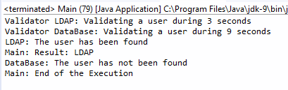
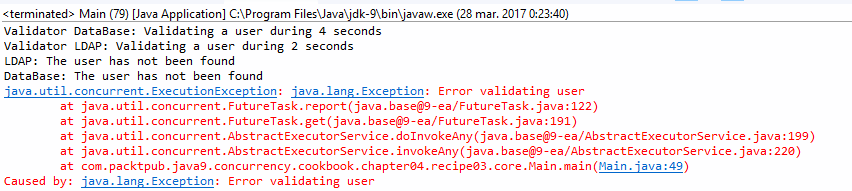

### 结果分析

本案例的核心在于 `Main` 类。 `ThreadPoolExecutor` 类中的 `invokeAny()` 方法接收一个任务列表，然后启动它们，并返回第一个成功执行且无异常的结果。该方法的返回类型和 `call()` 方法的相同。在本案例中返回的是 `String` 类型数据。

下图展示了其中一个用户校验任务时的输出结果：

本案例包含两个随机返回的布尔型的 `UserValidator` 对象。每个 `UserValidator` 对象都由一个实现了 `Callable` 接口的 `TaskValidator` 对象所调用。如果 `UserValidator` 类中的 `validate()` 方法返回 `false` ，则 `TaskValidator` 类会抛出一个异常；否则返回 `true` 。

若是提交了两个返回 `true` 或是抛出异常的任务，则它们会有如下4种可能。

+ 两个任务都返回 `true` 。然后 `invokeAny()` 方法会返回第一个执行完成任务的名称。
+ 第一个任务返回 `true` ，而第二个任务抛出异常。然后， `invokeAny()` 方法会返回第一个任务的名称。
+ 第一个任务抛出异常，而第二个任务返回true。然后， `invokeAny()` 方法会返回第二个任务的名称。
+ 两个任务都抛出异常。在这种情况下， `invokeAny()方` 法抛出一个 `Execution- Exception` 异常。

如果多次运行本案例，则上述4种情况都会发生。

下图展示了当两个任务全抛出异常时的输出结果：

