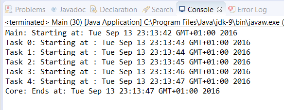

### 结果分析

本案例的核心在于 `Main` 类和 `ScheduledThreadPoolExecutor` 的管理。Java推荐用 `ExThreadPoolExecutor` 类来创建一个 `ThreadPoolExecutor` 类型的 `scheduled` 执行器。在本案例中，我们调用了 `newScheduledThreadPool()` 方法，并传入数字1作为该方法的参数。该参数代表着预设线程池中的线程数量。

为了在一段时间后可在 `Scheduled` 执行器中执行任务，我们需要使用 `schedule()` 方法。该方法接收如下3个参数。

+ 想要执行的任务。
+ 在任务执行前需等待的时间间隔。
+ 时间间隔的单位，这里为一个 `TimeUnit` 类的常量。

在本案例中，每个任务等待的秒数（ `TimeUnit.SECONDS` ）都为该任务在数组中的位置+1。

> 
> 如果想要在某个指定时刻执行任务，则需要计算当前时间与给定时刻的时间间隔，并将该时间间隔设置为任务的延迟时间。

下图展示了执行本例中一个任务后的输出结果：

可以看到任务间隔1s后逐个启动。所有任务同时提交给执行器，但是每个任务都在上个任务启动1s后才启动。

