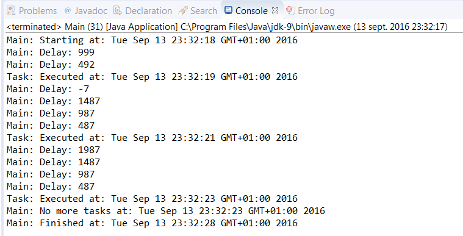

### 结果分析

如果想要使用 `Executor` 框架周期性地执行任务，则需要使用 `ScheduledExecutor- Service` ，Java建议在每个执行器内使用 `Executors` 类来创建它。 `Executors` 类的作用类似于执行器实例对象的工厂。本案例用 `newScheduledThreadPool()方` 法来创建一个 `ScheduledExecutorService` 实例对象。该方法接收一个表示池中线程数的数字作为参数。因为在本例中只有一个任务，所以传递1作为参数。

如果提交任务给执行器后，需要使用执行器来执行周期性任务，则可以使用 `scheduled- AtFixedRate()` 方法。该方法包含4个参数：需要周期执行的任务，首次执行任务的延迟时间，两次任务的间隔和间隔的时间单位（一个 `TimeUnit` 类型的常量）。 `TimeUnit` 类对象是一个枚举类，包括 `DAYS` 、 `HOURS` 、 `MICROSECONDS` 、 `MILLISECONDS` 、 `MINUTES` 、 `NANOSECONDS` 和 `SECONDS` 。

需要思考的一个重点在于，执行两次任务的时间间隔是两次任务开始的时间间隔。如果现在有一个需要执行时间5s的周期性任务，但是设置的时间间隔为3s，那么在同一时间内将会有两个正在执行的实例任务。

本案例用 `scheduledAtFixedRate()` 方法处理周期性任务，该方法返回一个实现 `Future` 接口的 `ScheduledFuture` 对象。 `ScheduledFuture` 是一个泛型接口。在本例中，如果没有显式指定任务中 `Runnable` 对象的泛型，则将用“?”标记来作为泛型。

在 `ScheduledFuture` 接口中，用 `getDelay()方` 法来返回距下次任务的间隔时间。该方法会根据传入的时间单位来返回结果。

下图展示了本例中执行一个任务后的输出结果：

可以看到任务每2s调度1次，每500ms在控制台输出一次，根据这些信息可以知道主线程休眠了多久。当关闭执行器后，计划任务终止运行且不再输入任何信息。

