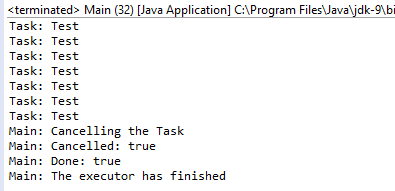

### 结果分析

若想取消一个已经提交给执行器的任务，则可以使用 `Future` 接口的 `cancel()` 方法。该方法的作用随着传入参数和任务状态的不同而变化。

+ 如果任务已经结束，或在更早之前已取消，或是其他原因不能取消，则该方法将会返回 `false` 且不会取消任务。
+ 如果任务在等着执行器分配线程，则这个任务会取消，不会再次调度。如果该任务已经在执行，则要视传入参数而定。 `cancel()` 方法接收一个布尔值作为参数。如果参数值为 `true` ，则会取消正在执行的任务；否则正在执行的任务不会取消。

下图展示了本例中执行一个任务后的输出结果：

