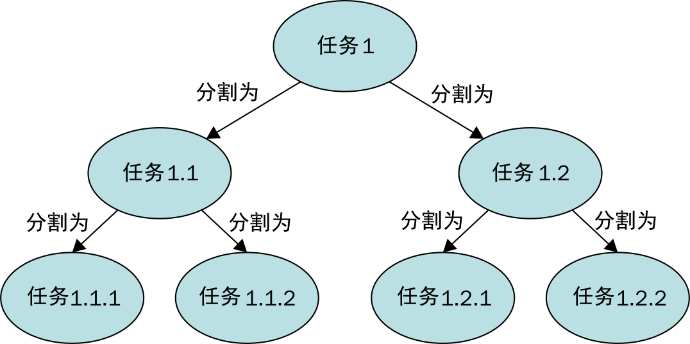

### 5.1 简介

正常来说，当要实现一个简单的并发应用时，你可以实现一些 `Runnable` 实例对象和对应的 `Thread` 实例对象。在程序中，你可以控制这些线程实例对象的创建、执行和线程的状态。Java 5中增加了 `Executor` 和 `ExecutorService` 接口及其实现类（例如 `ThreadPoolExecutor` 类）。

Executor框架将任务的创建和执行分离开来，因此只需实现 `Runnable` 实例对象并使用一个 `Executor` 对象即可实现并发应用。只需提交 `Runnable` 类型任务给执行器即可，它会创建、管理并结束对应的执行任务的线程。

Java 7则又前进了一大步，其中包括 `ExecutorService` 接口的用来处理特定问题的额外实现— **fork/join框架** 。

该框架的设计目的是以分而治之的思想来解决那些可以分解成较小任务的问题。在一个任务中，你可以检查所要解决问题的规模。如果问题规模大于给定规格，则将其分割成较小的任务并使用该框架来执行；如果问题规模小于给定规格，则可以在任务中直接解决问题，具体如下图所示。

本章并没有提供一个关于问题规模和问题是否需要分割的公式。你可以根据任务中需处理的元素数量和执行时间来确定参考大小，并测试不同的参考大小来选出最适合当前问题的参考大小。

该框架基于以下两个操作。

+ **fork操作：** 当将任务分割为更小的任务并使用该框架执行它们时。
+ **join操作：** 当一个任务等待它创建的所有任务结束时，该操作用来组合这些任务的执行结果。

fork/join框架和Executor框架最主要的区别在于 **工作量测** 算法。和Executor框架不同，当一个任务使用join操作等待它创建的子任务执行结束时，执行任务的线程（即 **工作线程** ），会寻找其他未执行的任务并执行它们。按照这种方式，线程可以最大程度地利用它们的执行时间，从而提升应用性能。

为了达到这个目标，fork/join框架执行的任务有如下限制。

+ 任务只能使用 `fork()` 和 `join()` 方法作为同步机制。如果在任务中使用了其他同步机制，工作线程在同步操作中就不能再执行其他任务。例如，如果让一个处于fork/join框架中的任务进入休眠状态，那么在任务休眠时执行这个任务的工作线程就不能执行其他任务。
+ 任务不应该执行任何I/O操作，如读/写文件中的数据。
+ 任务不能抛出受检异常。任务必须包含必要的处理受检异常的代码。

fork/join框架的核心由以下两个类组成。

+ `ForkJoinPool` ：该类实现了 `ExecutorService` 接口和工作量测算法。它管理工作线程并提供任务本身和任务执行过程的信息。
+ `ForkJoinTask` ：该类是在 `ForkJoinPool` 内所执行任务的基类。它提供了在任务内执行 `fork()` 和 `join()` 操作的机制，以及获取任务状态的方法。一般来说，为了实现fork/join任务，你需要实现该类的3个子类之一，即 `RecursiveAction` 类，任务不返回执行结果； `RecursiveTask` 类，任务返回一个执行结果； `CountedCompleter` 类，所有子任务执行完毕后启动一个完成方法。

虽然该框架提供的大部分特征都已包含在Java 7中，但是Java 8更新了少量特征，其中包括一个默认的 `ForkJoinPool` 对象，你可以使用 `ForkJoin` 类中的静态方法 `commonPool()` 来获取它。fork/join执行器默认使用和本机处理器数相等的线程数。你可以通过修改 `java.util.concurrent.ForkJoinPool.common.parallelism` 这一系统属性的值来修改默认行为。这个默认的池由并发API的其他类在内部使用，例如 **Parallel- Streams** 。此外，Java 8还包括之前提到的 `CountedCompleter` 类。

本章将介绍如何使用fork/join框架高效工作。

