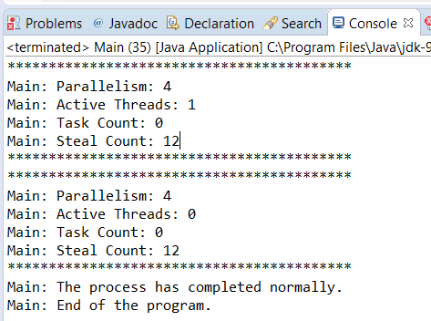

### 结果分析

本案例创建了一个 `ForkJoinPool` 对象和 `ForkJoinTask` 类的一个子类。其中， `ForkJoinPool` 对象是用无参构造方法创建的，因此它会使用默认的配置。该对象创建了一个线程数等于处理器数的池，当 `ForkJoinPool` 对象被创建时，对应线程也被创建并在池中等待任务执行。

由于 `Task` 类继承了 `RecursiveAction` 类，因此它没有返回结果，在本节中，使用了推荐的结构来实现任务。如果任务更新超过10件产品，则把产品分割成两组，分别分配给两个子任务。在 `Task` 类中， `first` 和 `last` 属性标明了需要更新的产品在产品列表中的位置。在每个任务中，使用 `first` 和 `last` 属性来获取产品列表的副本，而非另外创建一个列表。

本案例中调用 `invokeAll()` 方法创建每个任务的子任务。采用同步的方式调用该方法，且每个任务在继续执行前需要等待子任务执行完成。当任务在等待子任务执行时，工作线程会选取并执行另一个正在等待执行的任务。通过这种方式，相比 `Runnable` 或 `Callable` 来说，fork/join框架具有更好的性能。

`ForkJoinTask` 类中的 `invokeAll()` 方法是 `Executor` 和fork/join框架最主要的区别之一。在Executor框架中，所有任务都提交给执行器来执行。而本案例中，任务包含执行和控制池中任务的方法。调用的 `invoke` 方法来自 `Task` 类， `Task` 类继承了 `RecursiveAction` 类，而该类继承了 `ForkJoinTask` 类。

用 `execute()` 方法提交唯一的任务到池中，从而更新列表中的全部产品。在本案例中，该方法以同步方式在主线程中调用。

此外还使用了 `ForkJoinPool` 类中的部分方法来检查运行中任务的状态和执行情况。为了更好地实现本节目的，该类还提供了其他方法，在9.5节中，有这些方法的完整列表。

最后，和Executor框架一样，调用 `shutdown()` 方法关闭 `ForkJoinPool` 。执行结果如下图所示。

从图中可以看到，任务执行完成后，输出了产品更新后的价格。

