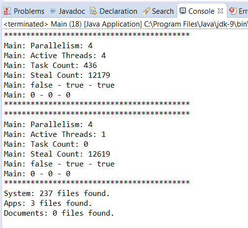

### 结果分析

本案例的部分执行结果如下图所示。

本案例的核心在于 `FolderProcessor` 类，每个任务处理一个文件夹的内容。这些内容包含如下两种元素：

+ 文件
+ 其他文件夹

如果任务找到一个文件夹，则它会创建另一个 `FolderProcessor` 实例对象来处理这个文件夹，并使用 `fork()` 方法将其提交到池中处理。该方法提交到池中的任务会由空闲的工作线程来执行，或是创建一个新的工作线程来执行。由于该方法会立即返回结果，因此任务可以持续处理文件夹中的内容。任务会对比每一个文件的扩展名和搜索文件的扩展名是否相同。若相同则将文件路径添加到结果列表。

当任务处理完分配给它的文件夹下全部内容后，你可以尝试结束任务。正如本节所介绍的，当你尝试结束一个任务时， `CountedCompleter` 会查找处理中的任务计数值。如果计数值大于 `0` ，则减少该计数；如果计数值等于 `0` ，则调用 `onCompletion()` 方法并试着结束父任务。在本例中，当一个任务处理一个文件夹并找到一个子文件夹时，则它创建一个新的子任务，并调用 `fork()` 方法来执行，同时让处理中的任务计数值自增。因此，当一个任务处理完全部内容时，处理中的任务计数值应该等于该任务启动的全部子任务数。当调用 `tryComplete()` 方法时，如果当前任务的文件夹包含子文件夹，则该调用将会减少处理中的任务计数值。只有当该任务的全部子任务执行结束， `onCompletion()` 方法才会运行。如果当前任务的文件夹下不包含任何子文件夹，则处理中的任务计数值将为 `0` ，而 `onComplete()` 方法将会立刻执行，并试着结束它的父任务。按照这种方式，可以自顶向下创建了一棵任务树，并自底向上完成该任务。在 `onComplete()` 方法中，处理全部子任务返回的结果列表并汇总到当前任务的返回结果列表中。

`ForkJoinPool` 类也允许任务以异步方式运行。你可以调用 `execute()` 方法提交3个初始任务到池中。在 `Main` 类中，调用 `shutdown()` 方法关闭池，并打印正在运行的任务状态和运行信息。 `ForkJoinPool` 类还包含了其他有用的方法，在9.5节中，有这些方法的完整列表。

