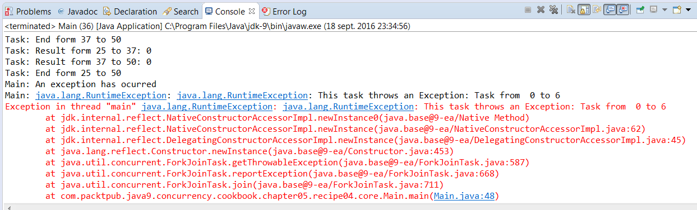

### 结果分析

本节通过实现 `Task` 类来处理一个整型数组。该类检查要处理的元素大小是否超过 `10` ，如果超过 `10` 则分割成两组，并创建两个新的 `Task` 实例对象来处理这些元素；否则检查这些元素是否在数组中处于前4个位置，若是则抛出 `RuntimeException` 异常。当程序运行时，程序不会在抛出异常时停止运行。在 `Main` 类中，你在初始任务中调用 `ForkJoinTask` 类的 `isCompletedAbnormally()` 方法，如果该任务或者其子任务抛出异常，则该方法返回 `true` 。也可以调用同一个实例对象中的 `getException()` 方法来获取抛出的异常。

当在任务中抛出一个未受检异常时，它会影响到其父类，以及父类的父类等。如果修改程序的整体输出，则可以看到部分任务的结束信息不会在控制台中输出。这些任务输出的开头信息如下所示：

```css
Task: Starting form 0 to 100
Task: Starting form 0 to 50
Task: Starting form 0 to 25
Task: Starting form 0 to 12
Task: Starting form 0 to 6
```

这些任务是抛出异常的任务及其父类，它们都未正常结束。在开发程序时，我们应该考虑是否想要可以抛出异常的 `ForkJoinPool` 和 `ForkJoinTask` 实例对象。

本案例的部分运行结果如下图所示。


