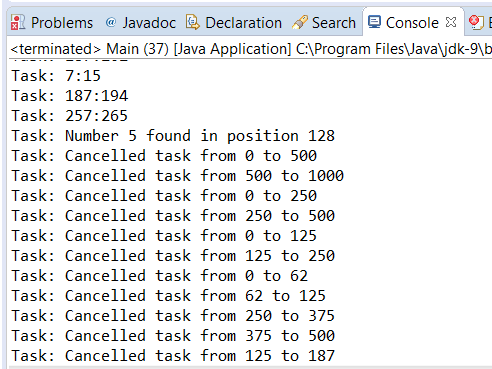

### 结果分析

`ForkJoinTask` 类提供的 `cancel()` 方法允许你取消还未执行的任务。如果任务已经开始执行，那么调用 `cancel()` 方法就没有任何作用，这点非常重要。该方法接收一个名为 `mayInterruptIfRunning` 的布尔值作为参数。该参数名容易让人误以为，如果传递 `true` 值作为参数，那么即使是运行中的任务也会被取消。然而根据Java API的定义可知，在 `ForkJoinTask` 类的默认实现中，该变量不起任何作用。只有未开始执行的任务才能被取消，对已经提交到池中的任务来说，取消操作不起任何作用，这些任务会继续执行。

fork/join框架的一个限制在于它不允许直接取消 `ForkJoinPool` 池中的全部任务。为了克服该限制，本案例实现了 `TaskManager` 类。该类存储了全部提交到池中的任务，并提供了取消全部存储任务的方法。如果一个任务由于正在运行或是运行完成而不能取消的话，那么 `cancel()` 方法将返回 `false` 。因此可以直接取消全部任务，而不必担心可能产生的负面影响。

在本案例中，我们实现了一个在数组中搜索数字的任务，并按照fork/join框架推荐的方式分割任务为更小的子任务。由于你只关心该数字的出现，所以当任务查询到该数字时，取消其他任务。

本案例的部分运行结果如下图所示。

