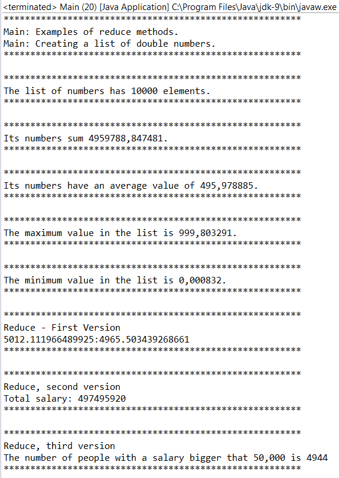

### 结果分析

从以上的例子可以学习如何使用Java流提供的不同归约操作。首先，我们使用了 `DoubleStream` 、 `IntStream` 和 `LongStream` 提供的一些特殊的归约操作。这些操作计算流中元素的数量、平均值、总和、最大值和最小值。如果使用普通流，则只有计算元素总数的 `count()` 方法。

然后使用 `Stream` 类提供的3个版本的 `reduce()` 方法。第一个版本只接收一个 `BinaryOperator` 参数。我们用lambda表达式指定了 `BinaryOperator` ，而且通常都是这么做的，不过也可以使用一个实现 `BinaryOperator` 接口的实例对象。该运算对象接收流中的两个元素，然后生成一个相同类型的新元素，比如接收两个 `Point` 对象并生成一个新的 `Point` 对象。 `BinaryOperator` 所实现的操作必须符合结合律，也就是说，如下表达式必须为真：

```css
(a op b) op c = a op (b op c)
```

这里的 `op` 就是 `BinaryOperator` 。

该版本的 `reduce()` 方法返回了一个 `Optional` 对象。 `Optional` 存在的原因是，如果流是空的，则它不会返回一个结果值，也就是说， `Optional` 对象会是空的。

第二个版本的 `reduce()` 方法接收了一个满足同一律的值和一个 `BinaryOperator` 。这个 `BinaryOperator` 也必须满足结合律，这点和其他版本的 `reduce()` 方法一样。而对于一个满足同一律的值，必须使如下表达式为真：

```css
identity op a = a op identity = a
```

该版本的 `reduce()` 方法返回了一个和流中元素相同类型的结果。如果流里没有元素，则返回同一律值。

最后一个版本的 `reduce()` 方法用在返回值和元素类型不同时。在这种情况下，该方法有3个参数： `identity` 值、 `accumulator` 运算函数和 `combiner` 运算函数。 `accumulator` 运算函数接收与该方法返回值相同类型的值和流的元素，并生成和返回值相同类型的新对象。

`combiner` 函数接收两个和返回值相同类型的对象，并计算出一个同类型的新对象。 `identity` 值是返回类型的 `identity` 值，它必须验证如下表达式：

```css
combiner(u, accumulator(identity, t))==accumulator(u, t)
```

这里的 `u` 是一个和返回值类型相同的对象， `t` 是流中的元素。

该案例的输出结果如下图所示。


