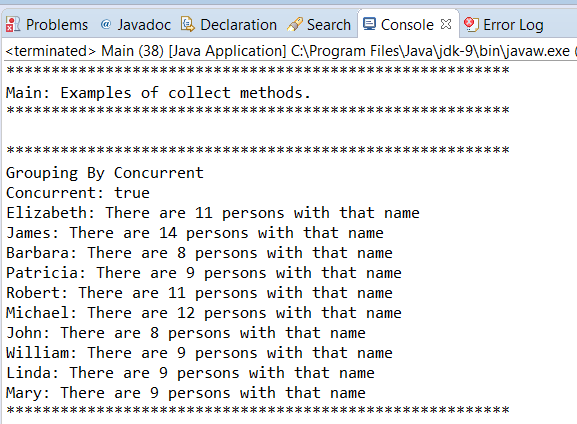
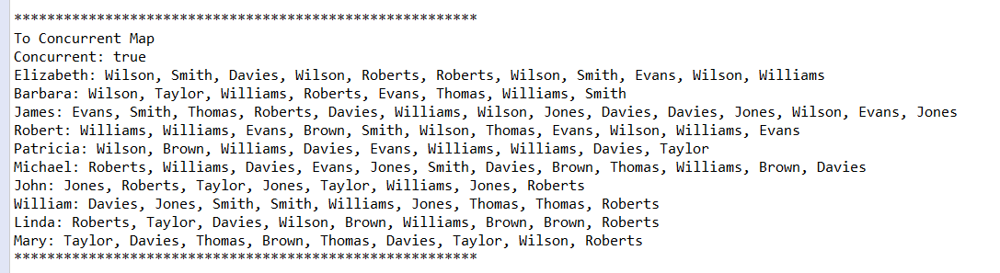

### 结果分析

我们在本节里曾提到， `collect()` 方法能对 `Stream` 中的元素进行可变归约。之所以称之为可变归约，是因为流的最终处理结果是一个可变的数据结构，比如 `Map` 或 `List` 。Java并发API中的 `Stream` 类提供了两种版本的 `collect()` 方法。

第一个版本只接收一个参数，它是一个 `Collector` 接口的实现。由于这个接口有7种方法，因此通常不会自己去实现 `Collector` ，而是使用帮助类 `Collectors` ，它的很多方法为归约操作返回了随时可用的 `Collector` 对象。我们在例子中使用了如下几个 `Collectors` 类的方法。

+ `groupingByConcurrent()` ：该方法返回一个 `Collector` ，能在流的元素上实现并发分组操作，并合成一个 `Map` 作为结果。它接收一个参数表达式用来从流的元素上获取 `Map` 的 `key` 。 `key` 的类型由参数表达式来返回，而 `Map` 中生成的 `value` 则是一个存放着元素的列表。
+ `joining()` ：该方法返回的 `Collector` 把流中的元素串联成一个字符串。你可以指定3个 `CharSequence` 类型的参数，一个用作元素间的分隔符，一个用作最终字符串的前缀，最后一个用作最终字符串的后缀。
+ `partitioningBy()` ：该方法返回的 `Collector` 和第一个类似。它接收一个 `Boolean` 类型的参数表达式，把元素组织成两组：一组符合表达式的要求，另一组不符合。最后的结果是一个 `Map` ， `key` 是 `Boolean` 类型， `value` 是包含流元素的列表。
+ `toConcurrentMap()` ：该方法返回的 `Collector` 能以并发方式生成 `ConcurrentMap` 。它接收如下3个参数。
      + 一个是能从流的元素上生成key的表达式。
    + 一个是能从流的元素上生成value的表达式。
    + 最后一个是，当在两个或多个元素上得到相同key时，能从两个value上生成新value的表达式。

`Characteristics` 枚举定义了 `Collector` 的行为，我们可为指定的 `Collector` 定义 `Characteristics` ，也可以不定义。对于我们来说，最重要的 `Characteristics` 是 `CONCURRENT` ，它表明了 `Collector` 是否能并发执行。在不能的情况下，仅通过创建一个并行流是无法利用计算机的多核处理器的。如果使用 `Collector` 的收集操作，则必须考虑 `Collector` 的 `CONCURRENT` 特性。只有当下面3种情况都为 `true` 时，我们的归约操作才是并发的。

+ `Stream` 是并行的（前面用过的 `parallelStream()` 和 `parallel()` 方法）。
+ `Collector` 允许并发访问。
+ 流是无序的，则 `Collector` 也是无序的。

在本案例中， `groupingByConcurrent()` 和 `toConcurrentMap()` 所返回的 `Collector` 都有 `CONCURRENT` 特性，而 `joining()` 和 `partitionBy()` 方法所返回的 `Collector` 则没有。

还有另外一个版本的 `collect()` 方法能用于并行流。该版本的 `collect()` 方法接收如下3个参数。

+ `supplier` 函数，它为收集操作生成和最终结果相同类型的数据结构。在并行流中，这个函数会调用很多次，因为会有多个线程执行该操作。
+ `accumulator` 函数，它接收一个数据结构和一个元素，并对元素做出处理。
+ `combiner` 函数，它接收两个数据结构，并生成一个唯一的、有着相同类型的数据结构。

可以使用lambda表达式实现这些函数，也可以为 `supplier` 函数提供 `Supplier` 接口实现，或者为 `accumulator` 和 `combiner` 提供 `BiConsumer` 接口实现（要用适当的泛型化参数）。你还能为合适的输入输出参数提供方法引用（如 `Class::Method` ）。比如，我们把 `List::new` 用作 `supplier` 函数，把 `List::addAll` 方法用作 `combiner` 函数。可以将更多的方法用作 `collect()` 方法的参数。

`groupingByConcurrent()` 操作的输出结果如下图所示。

`toConcurrentMap()` 操作的输出结果如下图所示。

