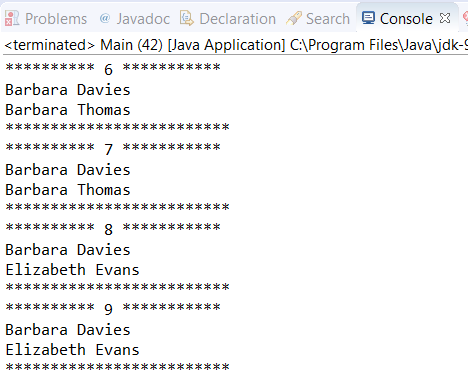

### 结果分析

`Stream` 因其源和中间操作而可能会有相遇顺序。相遇顺序会强制限制某些方法必须处理元素的顺序。比如，在有相遇顺序的 `Stream` 上使用 `limit()` 和 `skip()` 方法，它们将按相遇顺序获取和跳过排在前面的元素。有一些操作（如 `forEach()` 方法）不会考虑相遇顺序。多次在一个相同的有相遇顺序的流上执行 `forEach()` 操作，结果总是相同的。如果没有相遇顺序，则结果可能不同。

在处理串行流时，相遇顺序不会对应用程序的性能产生任何影响，但对于并行流，却可能造成极大的影响。对于不同的操作，有的可能需要多次处理 `Stream` 中的元素，而有的可能需要在一个缓存里存储大量的数据。在这些情况下，使用 `unordered()` 方法删除相遇顺序，会显著提升应用程序的性能。

此外， `sorted()` 方法对流中的元素进行了排序。如果使用这个方法，则 `Stream` 中的元素必须实现 `Comparable` 接口，否则就要传入一个 `Comparator` 参数来对元素进行排序。由于使用 `sorted()` 方法将会创建一个有序流，因此前面针对有相遇顺序的流而解释的所有东西，都适用由 `sorted` 产生的结果流。

最后， `forEach()` 方法不会考虑流的相遇顺序。如果你希望使用相遇顺序（比如说，在排序之后按顺序打印流中的元素），那么可以使用 `forEachOrdered()` 方法。

本案例的部分输出如下图所示。

可以看到，在由 `TreeSet` 生成的并行流上调用 `limit(1)` 方法时，总是会获得相同的结果，因为Stream API遵循了TreeSet的相遇顺序。而由于在调用 `unordered()` 方法之后，Stream API不再考虑相遇顺序，因此得到的结果会出现不同。

