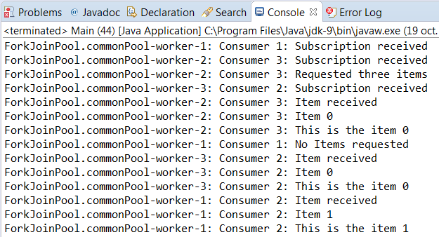

### 结果分析

反应式流的主要目标是提供一种机制，能以不阻塞背压的方式处理异步数据流，以期让信息的接收者能充分利用自己的资源。由于该机制是异步的，因此接收者不需要花费资源去寻找新的元素，当新元素到来时会调用接收者。由于无阻塞背压允许接收者只在准备妥当的时候才消费新元素，因此它们可以使用一个有界队列来存储传入的元素，不用担心被生产者的新元素压满。

Java的反应式流基于如下3个接口。

+ `Flow.Publisher` ：该接口只有一个方法。
      + `subscribe()` ：该方法接收一个 `Subscriber` 对象作为参数。发布者应该在发布 `Item` 时考虑该订阅者。  
+ `Flow.Subscriber` ：该接口有4个方法。
      + `onComplete()` ：发布者在完成自己执行的任务之后，应该调用订阅者的 `onComplete()` 方法。
    + `onError()` ：当出现错误必须要通知订阅者时，该方法被调用。
    + `onNext()` ：当发布者有一个新元素时该方法被调用。
    + `onSubscribe()` ：发布者在 `subscribe()` 方法中添加了订阅者之后调用该方法。  
+ `Flow.Subscription` ：该接口只有一个方法。
      + `request()` ：该方法用于订阅者向发布者请求新元素。

注意，这些都是接口，你可以在实现之后按需使用。合理的流程如下所示：

1．调用发布者的 `subscribe()` 方法，传递一个订阅者。

2．发布者创建一个 `Subscription` 对象并将其发送给订阅者的 `onSubscribe()` 方法。

3．订阅者用 `Subscription` 的 `request()` 方法向发布者请求元素。

4．当有元素要发布时，发布者通过订阅者的 `onNext()` 方法发布给所有请求了新元素的订阅者。

5．当结束自己的执行任务后，发布者调用订阅者的 `onComplete()` 方法。

Java API提供的 `SubmissionPublisher` 类实现了发布者接口及其行为。

下图展示了本案例的输出结果，可以看到，反应流的行为符合预期：

`Subscriber` 对象收到了自己的 `Subscription` 。因为 `Consumer1` 没有请求任何 `Item` ，所以也不会接收它们。因为 `Consumer3` 请求了3个，所以接收了3个 `Item` 对象。最后， `Consumer2` 对象将接收10个 `Item` 对象和一个发布者结束的通知。

