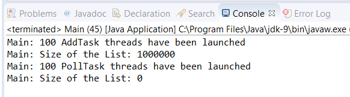

### 结果分析

在本节内容中，我们用 `ConcurrentLinkedDeque<String>` 的对象来实现一个非阻塞并发双端队列。本案例的执行结果如下图所示。

首先，执行100个 `AddTask` 任务来给数组添加元素。每个任务都会调用 `add()` 方法来将10000个数组元素插入到列表中。这个方法用于添加新的数组元素到双端队列的尾部。当所有任务都执行完以后，在控制台打印双端队列的元素个数。与此同时，这个双端队列就有了1000000个数组元素。

其次，执行100个 `PollTask` 任务来删除双端队列中的元素。每个任务都会用 `pollFirst()` 和 `pollLast()` 方法来删除10000个双端队列元素。 `pollFirst()` 方法返回并删除双端队列的第一个元素，而 `pollLast()` 方法则返回并删除双端队列的最后一个元素。如果双端队列没有任何元素，则它就会返回一个 `null` 值。当所有任务都已经完成后，在控制台打印这个双端队列中的元素个数。与此同时，列表中不会有任何元素。注意， `ConcurrentLinkedDeque` 的数据结构不允许添加 `null` 值。

可以用 `size()` 方法打印双端队列中的元素个数。你必须要考虑到这个方法可以返回的只是近似值，尤其是在线程中增删数组元素的时候去调用这个方法。这个方法必须遍历整个双端队列元素来统计个数，而且列表元素的个数可以改变这个操作。只有在调用这个方法时其他线程未修改这个双端队列的情况下，你才可以保证返回的统计结果是正确的。

