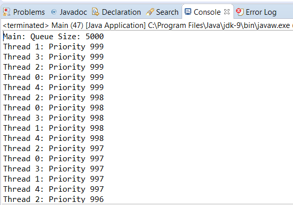

### 结果分析

本案例基于 `PriorityBlockingQueue` 类实现了一个 `Event` 对象的优先级队列。如同先前所介绍的，所有存储在 `PriorityBlockingQueue` 类中的元素都必须实现 `Comparable` 接口或者在该类的构造方法上提供一个 `Comparator` 对象。由于本例使用的是第一种情况，因此在 `Event` 类中实现一个 `compareTo()` 方法。

所有事件都有一个优先级字段，而优先级更高的事件会排在队列的首位。对于 `compareTo()` 方法来说，如果一个执行该方法的事件比另一个作为参数的事件具备更高优先级，则该方法会返回−1，否则会返回1。但当两个事件都具备相同优先级时，该方法会返回0。值得注意的是，在优先级相同的情况下， `PriorityBlockingQueue` 类不能保证它们的顺序。

`Task` 类负责添加 `Event` 对象到优先级队列中。具体来说，就是每个 `Task` 对象通过 `add()` 方法给队列添加优先级在0～999范围内的1000个事件。

`Main` 类的 `main()` 方法会创建5个 `Task` 对象，并且将其分配到对应的线程中执行。当所有线程执行完成以后，会在控制台中打印出所有元素。而为了从队列中获取到元素，则需要调用队列的 `poll()` 方法。该方法会返回队列的首个元素并在队列中移除该元素。

本案例的部分执行结果如下图所示。

通过控制台打印的文本可以清楚地了解到该队列是如何产生5000个元素的，排在首位的元素具有最高的优先级。

