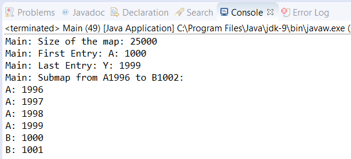

### 结果分析

在本节中， `Task` 类把多个 `Contact` 对象存储在一个 `navigable map` 中。每个 `contact` 各自都有一个基于任务ID创建的名称，以及一个范围为1000～2000的电话号码。然后合并 `contact` 的这些字段，并把合并结果作为 `key` 。每个 `Task` 对象创建1000个 `contact` 。这些 `contact` 通过 `put()` 方法存储在 `navigable map` 中。

> 
> 如果插入元素的key已经存储在map中，则原来与key关联的元素将会由新的元素所取代。

`Main` 类的 `main()` 方法以字母A～Z作为ID，创建了26个 `Task` 对象。然后使用一些方法来获取map中的数据。 `firstEntry()` 方法返回map的首个 `Map.Entry` 对象。该方法不会把元素从map中移除。该对象包含了key和value。可以用 `getValue()` 方法获取value，可以用 `getKey()` 方法来获取key。

`lastEntry()` 方法返回map的最后一个 `Map.Entry` 对象。 `subMap()` 方法返回map中 `ConcurrentNavigableMap` 对象的元素，在本案例中，返回的是 `A1996` 和 `B1002` 之间的元素。用 `pollFirst()` 方法可以处理来自 `subMap()` 方法中的元素。该方法会返回并移除 `submap` 的首个 `Map.Entry` 对象。

程序执行输出的部分结果如下图所示。

