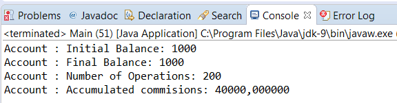

### 结果分析

本案例的关键就是 `Account` 类。本例声明 `AtomicLong` 类型的 `balance` 变量来存储账户的余额，同时声明一个 `LongAdder` 类型的 `operations` 变量来存储账户的数量，而且还声明一个 `DoubleAccumulator` 类型的 `commission` 变量来存储账户操作的值。 `commission` 对象的构造方法指定该值将会以 `0.2*y` 的形式来自增。正因如此，这可以通过 `accumulate()` 方法传入的参数并乘以0.2来增加变量的实际值。

为了实现返回 `balance` 字段的 `getBalance()` 方法，可以使用 `AtomicLong` 类的 `get()` 方法。为了实现返回 `operations` 的 `long` 型数值，用 `longValue()` 方法。为了实现 `getCommission()` 方法，可以使用 `DoubleAccumulator` 类的 `get()` 方法。为了实现设定 `balance` 字段的 `setBalance()` 方法，可以使用 `AtomicLong` 类的 `set()` 方法。

为了实现给 `account` 的 `balance` 字段添加导流的 `addAmount()` 方法，使用可以返回其值且以指定参数进行自增的 `AtomicLong` 类的 `getAndAdd()` 方法。同时可以使用自增其值的 `LongAdder` 类的 `increment()` 方法，以及可以根据具体表达式来增加 `commission` 字段的 `DoubleAccumulator` 类的 `accumulate()` 方法。请注意 `account` 的 `addAmount()` 方法并非是原子性的，即便其调用了3个原子性操作。

最后，为了实现减少 `balance` 字段的 `subtractAmount()` 方法，可以使用 `getAndAdd()` 方法。同时还应调取 `LongAdder` 类的 `increment()` 方法和 `Double-Accumulator` 类的 `accumulate()` 方法。

接下来，实现了两个不一样的任务。

+ `Company` 类模拟了一家公司增加其账户余额的业务。该类的每个任务都会增加10个1000。
+ `Bank` 类模拟了一家银行从账户中抽取资金的业务。该类的每个任务都会减少10个1000。

在 `Main` 类中，程序创建了一个带有1000  `balance` 的 `Account` 类对象。然后，执行一个 `bank` 的任务以及一个 `company` 的任务，因此 `account` 的 `balance` 最终值与初始值一致。

当执行该程序的时候，你会看见 `balance` 的最终值与初始值一致。下图展示了本案例运行的输出结果。

