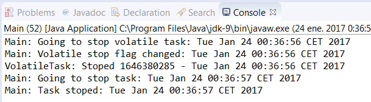

### 结果分析

本案例的输出内容如下图所示。

该应用不会完成相关功能，因为该任务的线程没有完成。当改变 `volatileFlag` 的值时（把它的 `flag` 字段标记为 `volatile` ），新值就会写进主存并且 `VolatileTask` 会立刻访问该值，然后执行完成。相反，当改变该 `flag` 对象的值时（它的 `flag` 字段不标记为 `volatile` ），则新值会存储在主线程的缓存中，并且任务对象不会看见该新值从而永远不会执行它。 `volatile` 关键字是非常重要的，不仅是因为它要求必须刷新写操作，还因为它确保读操作不是获取缓存值，而是从主存中获取最新的值。这是非常重要且经常被忽视的。

考虑到 `volatile` 关键字保证其修改操作可以写回到主存，但是它的相反面并不总是正确的。例如，如果一个没有 `volatile` 关键字的值被多个线程频繁修改，那么有可能可以看见其他线程的修改值，因为它们写回到了主存。但是，这不能保证这些修改是从缓存中传递到主内存的。

