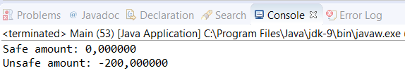

### 结果分析

下图展示了执行该应用的输出结果。

一方面，由于对同一个数值执行了加法和减法操作，因此预期的结果应该是0。能获得amount字段的结果是因为使用 `VarHandle` 来访问它，我们要保证原子性地修改它。另一方面， `unsafeAmount` 并没有获取预期的值。没有保护访问该值的行为，在这里会有一个数据竞争条件。

为了使用一个变量句柄，首先我们必须用 `MethodHandles` 的 `lookup()` 方法来获取它，然后是 `in()` 方法和 `findVarHandle()` 方法。 `lookup()` 方法返回一个 `Lookup` 对象，而 `in()` 方法返回了一个特定类的 `Lookup` 对象，然后使用 `Account` 类和 `findVarHandle()` 方法生成 `VarHandle` 对象，从而可以访问我们想要的字段。

一旦有了 `VarHandle` 对象，就可以利用不同的方法来使用不同的访问模式。在本案例中，我们使用了 `getAndAdd()` 方法。该方法保证了原子性访问来对该字段的值执行加法操作。我们可以传递这些对象来访问和增加它们的值。

后面会提供更多关于每一个案例中的各种访问模式和方法的信息。

