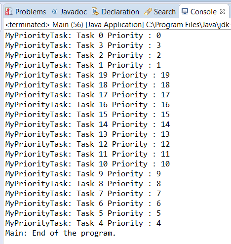

### 结果分析

把一个普通执行器转变为一个基于优先级的执行器是很简单的：只需传递一个 `PriorityBlockingQueue` 对象，其泛型参数为 `Runnable` 接口。但由于此执行器的特殊性，因此应该知道所有存储在一个优先级队列中的对象都必须实现 `Comparable` 接口。

先前实现的 `MyPriorityTask` 类之所以实现了 `Runnable` 接口，是因为它成了一个任务类；该类还实现了 `Comparable` 接口，此举则是为了使其对象能够存储在优先级队列中。如果一个任务的优先级字段有更大的值，则它会更早地执行。 `compareTo()` 方法决定了任务在队列中的执行顺序。在 `Main` 类中，向执行器传递了20个不同优先级的任务。传递给执行器的第一个任务是第一个被执行的。只要该执行器是空闲的，且正在等待任务加入，那么在新任务到达时，它就会立刻执行第一个新任务。由于创建了具有4个线程的执行器，因此前4个任务都会作为第一个任务来执行。然后，其余任务根据它们的优先级来执行。

本案例的执行过程如下图所示。

