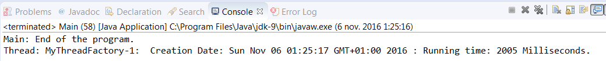

### 结果分析

通过8.4节的结果分析部分，我们了解了 `MyThread` 、 `MyThreadFactory` 和 `MyTask` 的工作原理。

在本案例的 `main()` 方法中，我们用 `Executors` 类的 `newCachedThreadPool()` 方法创建了一个 `Executor` 对象。因为传递了一个之前创建的工厂对象作为参数，所以该 `Executor` 对象将会使用该工厂来创建它所需要的线程对象以及执行 `MyThread` 类的线程。

执行本程序后，将会看见一条关于线程的启动日期及其执行时间的信息。下图展示了本案例生成的输出信息：

