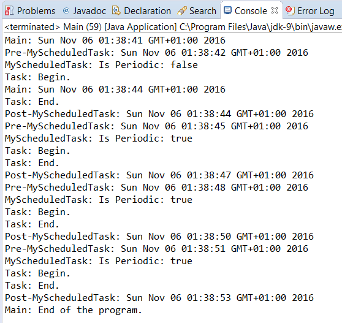

### 结果分析

在本节中，我们设计了 `MyScheduledTask` 类来实现可以在 `ScheduledThreadPool Executor` 执行器上执行的自定义任务。该类扩展了 `FutureTask` 类并实现了 `Runnable ScheduledFuture` 接口。它实现了 `RunnableScheduledFuture` 接口，在调度执行器中执行的所有任务必须实现此接口并扩展 `FutureTask` 类。这是因为该类提供了 `Runnable ScheduledFuture` 接口中声明方法的有效实现。前面提到的所有接口和类都是泛型类的，它们能感知到由任务返回的数据类型。

要在调度执行器中使用 `MyScheduledTask` 任务，请重写 `MyScheduledThreadPool Executor` 类中的 `decorateTask()` 方法。该类扩展了 `ScheduledThreadPoolExecutor` 执行器，该方法提供的机制将 `ScheduledThreadPoolExecutor` 执行器实现的默认计划任务转换为 `MyScheduledTask` 任务。所以，当实现自己的计划任务时，你必须实现自己的调度执行器。

> 
> `decorateTask()` 方法只需创建一个带有4个参数的新 `MyScheduledTask` 对象。第一个是将要在任务中执行的 `Runnable` 对象。第二个是由任务返回的对象。在这种情况下，任务不会返回结果，因此你使用空值。第三个是新对象要在线程池中取代的任务，而最新的执行器正在执行任务。在这种情况下，可以使用 `this` 关键字来引用正在创建任务的执行器。

`ScheduledTask` 类可以执行延迟和周期任务。要使用所有必需的逻辑来执行这两种任务，它们是 `getDelay()` 和 `run()` 方法。

调度执行器调用 `getDelay()` 方法来了解它是否必须执行任务。此方法行为在延迟和周期性任务中发生变化。如前所述， `MyScheduledClass` 类的构造方法接收将要执行 `Runnable` 对象的原始 `ScheduledRunnableFuture` 对象，并将其作为该类的一个字段来存储，以访问其方法和值。当执行延迟任务时， `getDelay()` 方法返回原始任务的延迟时间；但是，在执行周期任务时， `getDelay()` 方法返回 `startDate` 字段和实际日期之间的差值。

`run()` 方法是执行任务的方法。周期性任务的一个特殊性是，如果你想要再次执行任务，则必须将下一次执行任务作为新任务放入执行器的队列中。因此，如果你正在执行周期任务，则需要建立 `startDate` 字段值并将其添加到任务执行的实际日期和时间段中，然后将任务再次存储在执行器的队列中。 `startDate` 字段存储下一次执行任务的日期。然后，使用 `FutureTask` 类提供的 `runAndReset()` 方法执行任务。在执行延迟任务时，你不必将它们放入执行器的队列中，因为它们只能执行一次。

> 
> 还必须考虑执行器是否已关闭。如果是，则不必将周期性任务再次存储在执行器的队列中。

最后，重写 `MyScheduledThreadPoolExecutor` 类中的 `scheduleAtFixedRate()` 方法。我们前面提到，对于周期性任务，应使用任务的周期值来确定 `startDate` 字段值，但该周期值尚未初始化。你必须重写这个方法，该方法接收这个周期值作为参数。这就意味着可以将周期值传递给 `MyScheduledTask` 类，以便该类使用它。

本案例是用实现 `Runnable` 接口的 `Task` 类编写的，而该类就是在调度执行器中执行的任务。本案例的主类创建了一个 `MyScheduledThreadPoolExecutor` 执行器，并将以下两个任务发送给它：

+ 延迟任务，将在实际日期后1s执行；
+ 周期任务，在实际日期之后第一次执行，然后每3s执行一次。

下图显示了本案例执行的一部分结果。可以检查两种任务是否正确执行。

