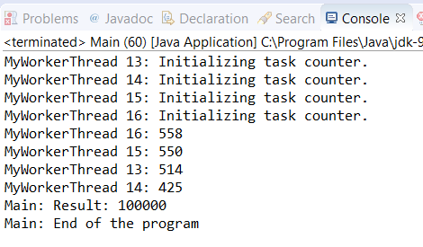

### 结果分析

fork/join框架使用的线程称为工作线程。Java中包含的 `ForkJoinWorkerThread` 类扩展了 `Thread` 类并实现了fork/join框架使用的工作线程。

本节实现了 `MyWorkerThread` 类，它扩展了 `ForkJoinWorkerThread` 类并重写了它的两个方法。目标就是在每个工作线程中实现一个任务计数器，以便可以知道工作线程执行了多少个任务。使用 `ThreadLocal` 字段来实现计数器。这样，每个线程都会以透明的方式为使用者提供计数器。

重写 `ForkJoinWorkerThread` 类的 `onStart()` 方法可以初始化任务计数器，当工作线程开始执行时调用此方法。重写 `onTermination()` 方法可以将任务计数器的值打印到控制台，当工作线程完成其执行时会调用此方法。另外，在 `MyWorkerThread` 类中实现的 `addTask()` 方法可以递增每个线程的任务计数器。

与Java并发API中的所有执行器一样，由于 `ForkJoinPool` 类使用工厂创建其线程，因此，如果想在 `ForkJoinPool` 类中使用 `MyWorkerThread` 线程，那么必须实现自己的线程工厂。对于fork/join框架来说，该工厂必须实现 `ForkJoinPool.ForkJoinWorker ThreadFactory` 类。为此，应实现 `MyWorkerThreadFactory` 类。它只有一个方法可以创建一个新的 `MyWorkerThread` 对象。

最后，只需要用所创建的工厂初始化一个 `ForkJoinPool` 类。可在 `Main` 类中使用 `ForkJoinPool` 类的构造方法来完成此操作。

下图显示了该程序输出的一部分。

可以看到， `ForkJoinPool` 对象如何执行4个工作线程以及每个线程执行了多少个任务。

