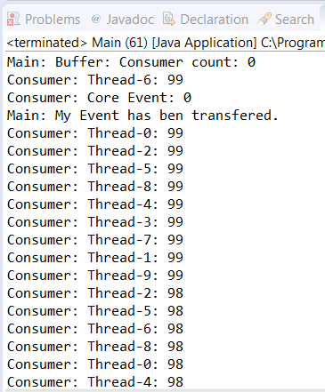

### 结果分析

本案例实现了 `MyPriorityTransferQueue` 数据结构。这是一个用于生产者/消费者问题的数据结构，但其元素按优先级来排列，而不是顺序排列。由于Java不允许有多重继承，因此所做的第一个决定与 `MyPriorityTransferQueue` 类的基类有关。扩展该类以使用 `PriorityBlockingQueue` 中实现的操作，而不是单纯地实现它们。还实现了 `Transfer Queue` 接口来添加与生产者/消费者相关的方法。之所以做出这个选择，是因为我们认为实现 `TransferQueue` 接口的方法比 `PriorityBlockingQueue` 类中实现的方法更容易。但是，也可以实现从 `LinkedTransferQueue` 类上扩展而来的类，并实现必要的方法来获取自己的 `PriorityBlockingQueue` 类的版本。

`MyPriortyTransferQueue` 类具有以下3个字段。

+ 一个 `AtomicInteger` 类型的 `counter` 字段：该字段存储在数据结构中等待获取元素的消费者的数量。当消费者调用 `take()` 操作从数据结构中获取元素时，计数值会递增。当消费者执行完成 `take()` 操作时，计数值再次递减。该计数器用于实现 `hasWaitingConsumer()` 和 `getWaitingConsumerCount()` 方法。
+ 一个 `ReentrantLock` 类型的 `lock` 字段：该字段用于控制对已实现操作的访问，而且只允许一个线程处理数据结构。
+ 最后一个 `LinkedBlockingQueue` 列表来存储传输的元素。

我们在 `MyPriorityTransferQueue` 中实现了一些方法。所有方法都在 `Transfer Queue` 接口中声明，并且 `take()` 方法在 `PriorityBlockingQueue` 接口中实现。这两个都在前面已描述过，以下是对其余方法的描述。

+ `tryTransfer(E e)` ：该方法尝试直接向消费者发送元素。如果消费者正在等待，则它将该元素存储在消费者立即消费的优先级队列中，然后返回 `true` ；如果没有消费者在等待，则返回 `false` 。
+ `transfer(E e)` ：该方法直接将一个元素传递给消费者。如果有消费者在等待，则它将该元素存储在优先级队列中以供消费者立即使用；否则，该元素将存储在传输元素的列表中，并且该线程将会阻塞，直到使用元素。当线程进入休眠状态时，必须释放锁，因为如果不这样做，将会阻塞队列。
+ `tryTransfer(E e,long timeout,TimeUnit unit)` ：该方法与 `transfer()` 方法相似，但此处线程会阻塞由其参数确定的时间段。当线程进入休眠状态时，必须释放锁，因为如果不这样做，会阻塞队列。
+ `take()` ：该方法返回要使用的下一个元素。如果传输元素的列表中有元素，则从列表中取出该元素。否则，它将从优先队列中取出。

一旦实现了该数据结构，就要实现 `Event` 类。它是存储在数据结构中的元素的类。 `Event` 类有两个字段来存储生产者ID和事件优先级，并且它实现了 `Comparable` 接口，因为这是该数据结构的一个要求。

然后，实现生产者和消费者类。在这个例子中，有10个生产者和1个消费者，它们共享相同的缓冲区。每个生产者生成100个具有递增优先级的事件，因此具有较高优先级的事件是最后生成的。

本案例的主类创建了一个 `MyPriorityTransferQueue` 对象、10个生产者和1个消费者，并使用 `MyPriorityTransferQueue` 缓冲区中的 `transfer()` 方法将两个事件传递到缓冲区。

下图显示了该程序执行的一部分输出内容。

可以看到具有更高优先级的事件是如何首先被消费的，并且消费者是如何消费传递事件的。

