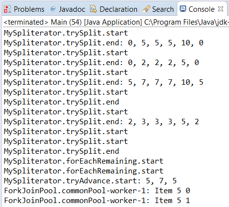

### 结果分析

本案例的重点是 `Spliterator` 。该接口定义了可处理和分割要使用的元素源的方法，例如 `Stream` 对象的源。很少直接使用 `Spliterator` 对象。只有想要一个不同的行为时——也就是说，如果想实现自己的数据结构，并从它上创建流——使用 `Spliterator` 对象。

`Spliterator` 有一组可定义其行为的特征，如下所示。

+ `CONCURRENT` ：可以同时安全地修改数据源。
+ `DISTINCT` ：数据源中的所有元素都是不同的。
+ `IMMUTABLE` ：可以在数据源中添加、删除或替换元素。
+ `NONNULL` ：数据源中没 `null` 值。
+ `ORDERED` ：在数据源的元素中遇到的一个问题。
+ `SIZED` ：由 `estimateSize()` 方法返回的值是 `Spliterator` 的确切大小。
+ `SORTED` ：对 `Spliterator` 的元素进行排序。
+ `SUBSIZED` ：调用 `trySplit()` 方法后，可以获得 `Spliterator` 的两个部分的确切大小。

在本案例中，我们定义了 `Spliterator` 的 `DISTINCT` 、 `IMMUTABLE` 、 `NONNULL` 、 `ORDERED` 、 `SIZED` 和 `SUBSIZED` 特性。

然后，我们实现了没有默认实现方案的 `Spliterator` 接口定义的所有方法。

+ `characteristics()` ：该方法返回 `Spliterator` 对象的特性。具体来说，它会返回一个整型值，可以使用 `Spliterator` 对象各个特性之间的按位或运算符（|）计算该值。要注意返回值与 `Spliterator` 对象的真实特征应该要一致。
+ `estimateSize()` ：如果在当前调用它，则该方法返回由 `forEachRemaining()` 方法处理的元素数。在本案例中，它返回了已知的确切值，但方法的定义说明了这是估算的大小。
+ `tryAdvance()` ：该方法将指定的参数作为参数应用于下一个要处理的元素（如果有）中，并返回 `true` 。如果没有要处理的元素，则它返回 `false` 。在本案例中，该方法收到一个 `Item` 对象处理的 `Consumer` ，但一次处理了一行 `Item` 对象。所以我们遍历了该行的所有项并调用了 `Consumer` 的 `accept()` 方法。
+ `trySplit()` ：该方法可将当前的 `Spliterator` 分成两个不同的部分，因此每个部分可以由不同的线程处理。在理想的情况下，应该将数据源分成两部分，它们具有相同数量的元素。但是，在本案例中，我们计算了开始和结束索引之间的中间元素并生成了两个元素块。从开始到中间的部分由当前的 `Spliterator` 处理，而从中间到结束部分则由新的 `Spliterator` 对象处理。如果无法拆分数据源，则该方法返回 `null` 值。由于在本案例中， `Spliterator` 只有两个元素，所以不会分割它。

`Spliterator` 接口的其他方法有一个默认实现。我们重写了 `forEachRemaining()` 方法，该方法将收到的函数接口对象作为参数（ `Consumer` 接口的实现）应用于尚未处理的 `Spliterator` 元素。我们实现自己的版本以在控制台中打印消息。我们用 `tryAdvance()` 方法来处理每个单独项。

下图显示了本例的部分输出结果。

首先，调用 `trySplit()` 方法来分割数据源，然后调用 `forEachRemaining()` 方法来处理由 `trySplit()` 方法生成的每个 `Spliterator` 中的所有元素。

