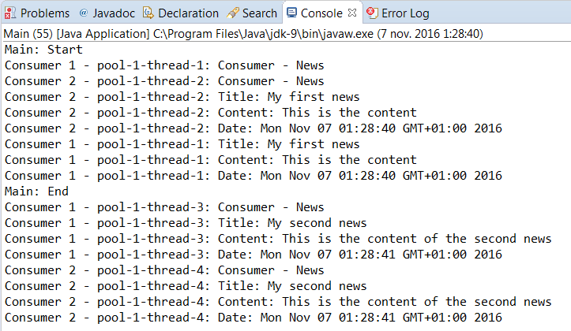

### 结果分析

在本案例中，我们使用Java 9 API提供的接口实现了发布者和订阅者之间的反应式流通信，并且遵循了反应式流规范中定义的预期行为。

我们有一个由 `MyPublisher` 类实现的发布者和由 `Consumer` 类实现的订阅者。发布者之间有订阅，并且每个订阅者都由 `MySubscription` 对象来实现。

通信周期从订阅者调用发布者的 `subscribe()` 方法开始。发布者必须在它们之间创建订阅，并使用 `onSubscribe()` 方法将订阅发送给订阅者。订阅者必须使用订阅的 `request()` 方法来表明它已准备好处理来自发布者的更多元素。当发布者发布一个数据项时，它会将其发送给所有订阅者，而这些订阅者都要使用发布者之间订阅的请求。

我们添加所有必要的元素以保证这种行为以并发方式进行。

本案例的输出结果如下图所示。

