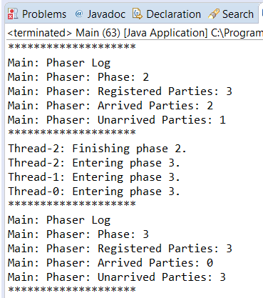

### 结果分析

本节实现了包含3个阶段的 `Task` 类，在该类中使用 `Phaser` 接口同步不同对象中各个阶段的工作。在程序的主类中启动了3个任务，在这些任务的各自执行阶段，将当前 `phaser` 的状态输出到控制台上。开发者可以通过以下方法获知 `phaser` 对象的状态。

+ `getPhase()` ：该方法返回 `phaser` 对象实际所处的阶段。
+ `getRegisteredParties()` ：该方法返回当前使用 `phaser` 对象作为同步机制的任务数量。
+ `getArrivedParties()` ：该方法返回当前完成某一阶段工作的任务数量。
+ `getUnarrivedParties()` ：该方法用于返回尚未完成某一阶段工作的任务数量。

下图显示了该程序输出的一部分。

