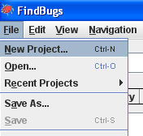
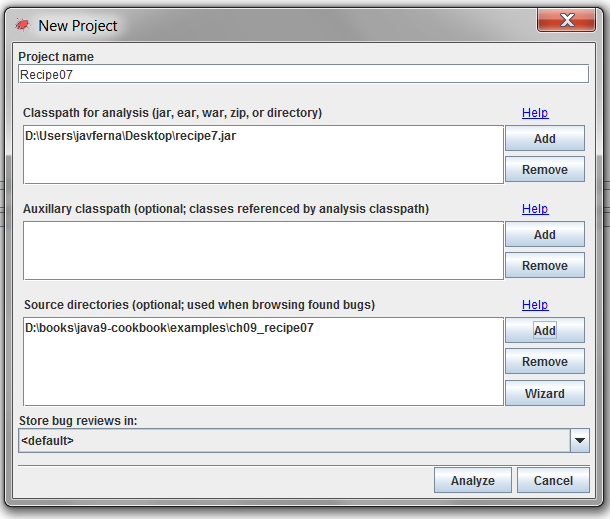

### 案例实现

按照如下步骤来实现本案例。

1．创建 `Task` 类，该类实现了 `Runnable` 接口：

```css
public class Task implements Runnable {
```

2．声明 `ReentrantLock` 类型的私有属性 `lock` ：

```css
private ReentrantLock lock;
```

3．实现类的构造函数：

```css
public Task(ReentrantLock lock) {
  this.lock=lock;
}
```

4．实现 `run()` 方法，并按以下步骤执行。获取锁、线程休眠2s、释放锁：

```css
@Override
public void run() {
  lock.lock();
  try {
    TimeUnit.SECONDS.sleep(1);
    lock.unlock();
  } catch (InterruptedException e) {
    e.printStackTrace();
  }
}
```

5．创建本案例的主类，新建是 `Main` 类和 `main()` 方法：

```css
public class Main {
  public static void main(String[] args) {
```

6．声明并创建 `ReentrantLock` 类型的 `lock` 对象：

```css
ReentrantLock lock=new ReentrantLock();
```

7．创建10个任务，并由10个线程分别执行这10个任务，通过 `run()` 方法启动线程：

```css
  for (int i=0; i<10; i++) {
    Task task=new Task(lock);
    Thread thread=new Thread(task);
    thread.run();
  }
}
```

8．通过IDE上的目录选项或者使用 `javac` 搭配 `.jar` 命令编译并打包工程文件为 `jar` 包，并将其命名为 `recipe7.jar` 。

9．在Windows环境执行 `findbugs.bat` 脚本，或者在Linux环境中执行 `findbugs.sh` 命令。启动独立的FindBugs应用。

10．找到目录栏中的 **File** 选项，并在下拉列表中选择 **New Project** ，创建一个新的项目工程，如下图所示。


11．此时_Fin__d__Bugs_应用将出现一个设置项目工程的窗口，在 **Project name** 一栏中键入 `Recipe07` 。在 **Classpath for analysis (jar, ear, war, zip, or directory)** 一栏中添加之前整理好的项目工程的jar包。在 **Source directories (optional; used when browsing found bugs)** 中添加本案例源代码所属的文件夹，操作如下图所示。


12．单击 **Analyze** 按钮，成功创建一个分析源代码的项目工程。

13．_FindBugs_窗口展示了代码的分析结果。本例代码存在两个缺陷。

14．单击其中一个代码缺陷，窗口右侧显示了问题代码的位置，其具体描述信息在窗口底部。

