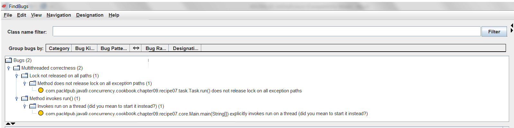
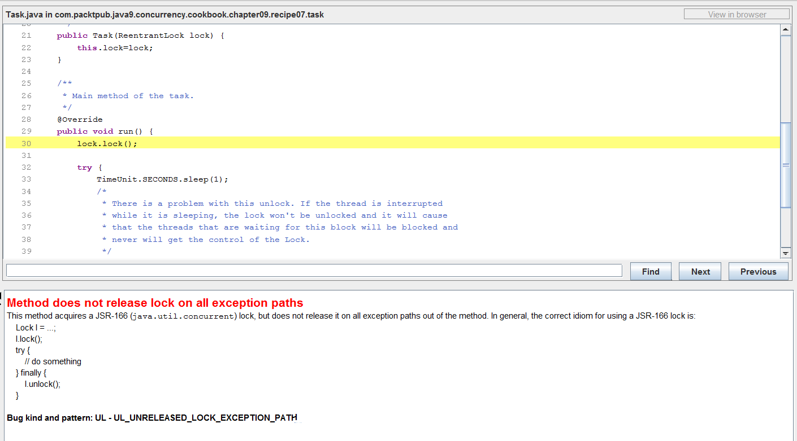

### 结果分析

FindBugs应用的分析结果如下图所示。

图中总共分析出了两处代码缺陷。

+ 其中一个缺陷在 `Task` 类的 `run()` 方法中检测到。在任务执行时，如果抛出了 `InterruptedException` 类型的异常，却并没有通过 `unlock()` 释放锁，那么这可能会导致应用出现死锁。
+ 另一个缺陷在 `Main` 类的 `main()` 方法中。线程是直接通过 `run()` 方法启动的而非 `start()` 方法。

双击任意一个缺陷，可以看到详情。由于刚才已经配置了项目代码的路径，因此可以看到缺陷代码的位置，如下图所示。

