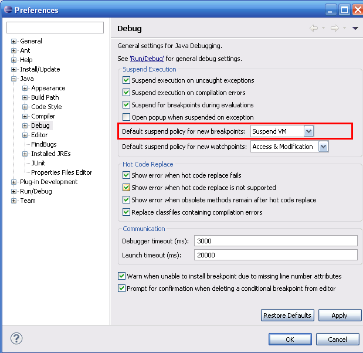

### 案例实现

根据如下步骤来实现本案例。

1．找到  **Window | Preferences** 。

2．展开目录左侧的 **Java** 选项。

3．选择 **Debug** 选项，界面如下图所示。

4．把 **Default suspend policy for new breakpoints** 选项的值从 **Suspend Thread** 改为 **Suspend VM** 。

5．单击 **OK** 按钮确认本次修改结果。

